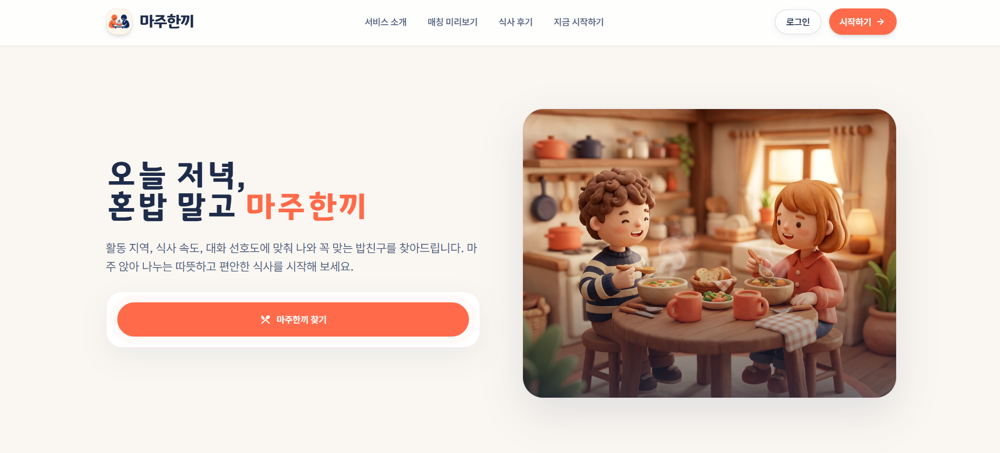
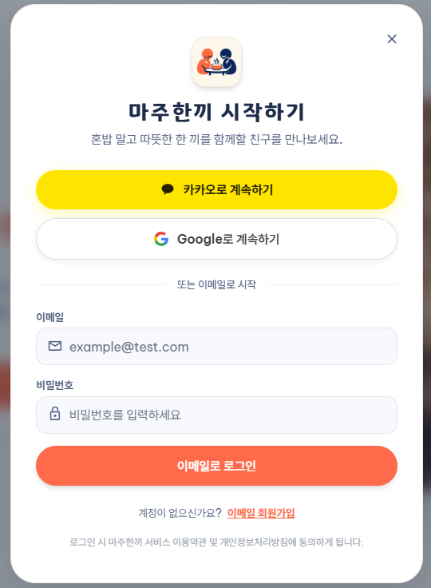
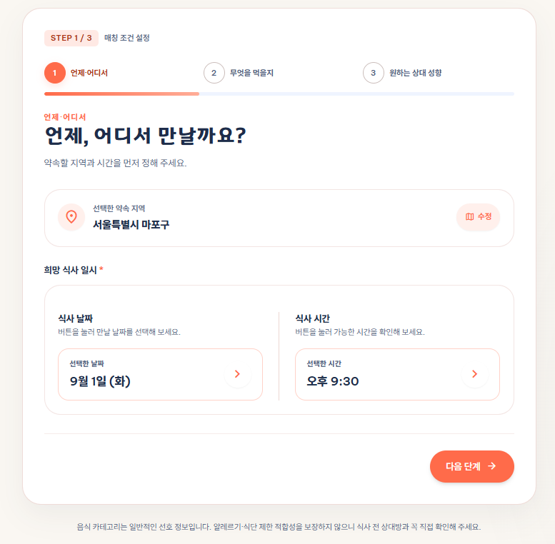
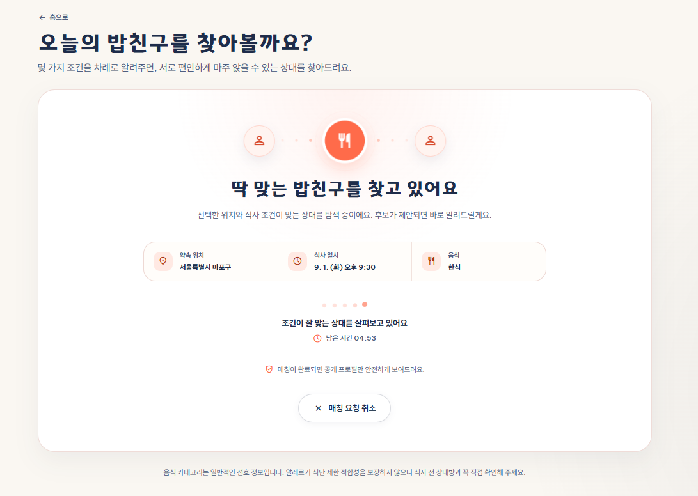
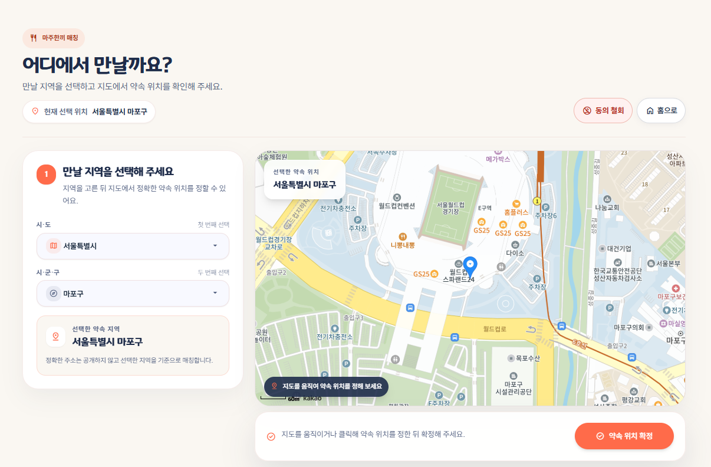
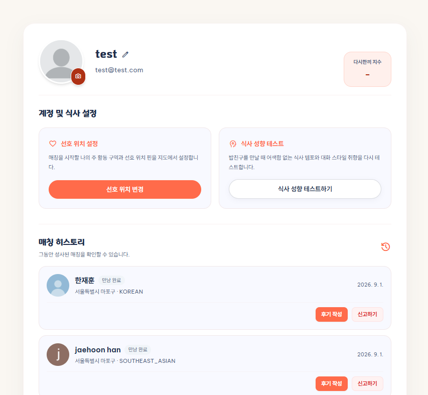
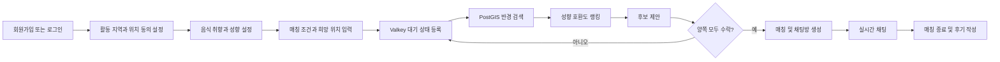
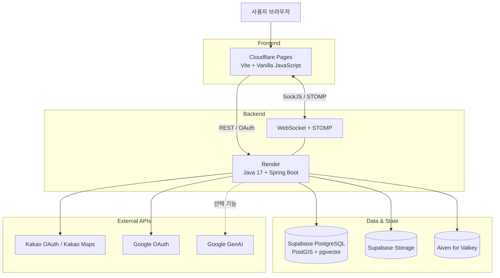

# 마주한끼 (Maju-Hankki)

<p align="center">
  
</p>

<p align="center">
  <strong>마주 앉아 나누는 따뜻한 한 끼, 혼밥 말고 마주한끼</strong><br>
  지역·시간·식사 취향·대화 성향을 바탕으로 오늘의 밥친구를 연결하는 실시간 1:1 식사 매칭 서비스입니다.
</p>


## 목차

- [팀원 소개](#팀원-소개)
- [프로젝트 소개](#프로젝트-소개)
- [서비스 미리보기](#서비스-미리보기)
- [핵심 기능](#핵심-기능)
- [서비스 이용 흐름](#서비스-이용-흐름)
- [시스템 아키텍처](#시스템-아키텍처)
- [기술 스택](#기술-스택)
- [핵심 설계와 문제 해결](#핵심-설계와-문제-해결)
- [프로젝트 구조](#프로젝트-구조)
- [로컬 실행 방법](#로컬-실행-방법)
- [환경변수](#환경변수)
- [API 문서](#api-문서)
- [테스트](#테스트)
- [배포 구성](#배포-구성)
- [관련 문서](#관련-문서)

## 팀원 소개

|                                   안상민                                   |                                  한재훈                                   |
|:-----------------------------------------------------------------------:|:----------------------------------------------------------------------:|
|  |  |
|                [@sang9831](https://github.com/sang9831)                 |                 [@ImJhoon](https://github.com/ImJhoon)                 |

## 프로젝트 소개

1인 가구와 사회적 고립이 늘면서 누군가와 가볍게 식사하고 자연스럽게 교류할 기회는 줄어들고 있습니다. 기존 소개팅이나 대규모 모임 서비스는 관계 형성에 대한 부담이 크고, 가까운 지역에서 지금 함께 식사할 한 사람을 찾기 어렵다는 문제가 있습니다.

마주한끼는 사용자가 직접 정한 활동 지역과 지도 핀, 식사 일정, 음식 취향, 대화 성향을 바탕으로 적합한 한 명의 밥친구를 연결합니다. 매칭 이후에는 실시간 채팅과 후기를 통해 만남 전후의 경험까지 하나의 흐름으로 제공합니다.

### 목표 사용자

- 혼자 식사하는 것이 부담스러운 20~30대
- 새로운 사람과 가볍게 교류하고 싶은 사용자
- 비슷한 식사 취향과 대화 성향을 가진 사람을 만나고 싶은 사용자

## 서비스 미리보기

<table align="center">
  <tr>
    <td align="center"><b>서비스 메인</b></td>
    <td align="center"><b>로그인</b></td>
    <td align="center"><b>매칭 조건 설정</b></td>
  </tr>
  <tr>
    <td></td>
    <td></td>
    <td></td>
  </tr>
  <tr>
    <td align="center"><b>매칭 진행</b></td>
    <td align="center"><b>약속 위치 설정</b></td>
    <td align="center"><b>마이페이지 및 매칭 이력</b></td>
  </tr>
  <tr>
    <td></td>
    <td></td>
    <td></td>
  </tr>
</table>

## 핵심 기능

| 기능 | 설명 |
| --- | --- |
| 회원 및 인증 | 이메일·비밀번호 회원가입과 로그인, 카카오 OAuth2 로그인, JWT 재발급과 로그아웃을 제공합니다. |
| 프로필 및 성향 설정 | 닉네임·프로필 이미지·활동 지역·음식 취향을 관리하고, 선택형 설문으로 식사 및 대화 성향을 설정합니다. |
| 위치 기반 실시간 매칭 | 사용자가 선택한 구와 지도 핀, 검색 반경, 식사 일정 등 필수 조건으로 실시간 1:1 매칭을 진행합니다. |
| 성향 기반 보조 랭킹 | 필수 조건을 통과한 후보를 결정론적 성향 점수로 정렬하고, 자유 서술 임베딩을 제한적인 보조 점수로 활용합니다. |
| 후보 제안 및 상호 수락 | 제한 시간 안에 양쪽 사용자가 후보 프로필을 확인하고 수락하면 매칭과 채팅방을 함께 생성합니다. |
| 실시간 채팅 | 매칭된 사용자만 WebSocket·STOMP 채팅방에 참여하여 메시지를 주고받을 수 있습니다. |
| 매칭 후기 | 실제로 완료된 매칭의 참여자만 재만남 의향과 선택형 인상 태그를 남길 수 있습니다. |
| 다시한끼 지수 | 공개 가능한 유효 후기를 집계해 재만남 의향을 참고 지표로 제공하며, 표본이 적을 때는 점수를 공개하지 않습니다. |
| 신고 및 관리자 처리 | 사용자 신고 접수와 관리자 검토·경고·이용 제한 기능을 제공합니다. |

## 서비스 이용 흐름



## 시스템 아키텍처



## 기술 스택

### Backend

| 구분 | 기술 |
| --- | --- |
| Language | Java 17 |
| Framework | Spring Boot 4.0.7, Spring MVC |
| Security | Spring Security, OAuth2 Client, JWT, Argon2 |
| Persistence | Spring Data JPA, Hibernate ORM |
| Realtime | WebSocket, STOMP, SockJS |
| AI | Spring AI 2.0.0, Google GenAI |
| Build | Gradle |
| API Documentation | Springdoc OpenAPI, Swagger UI |
| Monitoring | Spring Boot Actuator, Micrometer, Prometheus, Grafana |

### Frontend

| 구분 | 기술 |
| --- | --- |
| Language | HTML, CSS, Vanilla JavaScript |
| Build Tool | Vite 8 |
| Map | Kakao Maps JavaScript SDK |
| Realtime | SockJS, STOMP |

### Data & Infrastructure

| 구분 | 기술 |
| --- | --- |
| Database | Supabase PostgreSQL |
| Spatial Search | PostGIS `GEOGRAPHY(POINT, 4326)` |
| Vector Data | pgvector `vector(1536)` |
| Temporary State | Aiven for Valkey |
| Object Storage | Supabase Storage S3 호환 API |
| Backend Hosting | Render |
| Frontend Hosting | Cloudflare Pages |
| Local Monitoring | Docker Compose, Prometheus, Grafana |

## 핵심 설계와 문제 해결

### 1. DB와 Valkey의 역할 분리

- PostgreSQL에는 매칭 요청과 최종 결과처럼 보존해야 하는 데이터를 저장합니다.
- Valkey에는 중복 요청 방지 키, 대기 요청, 위치 인덱스, 후보 제안처럼 짧은 수명의 상태를 TTL과 함께 저장합니다.
- Valkey 키가 먼저 만료되거나 일시적으로 유실되면 주기적인 보정 작업이 DB 상태를 기준으로 복구하거나 만료 처리합니다.
- Redis 장애 중에는 DB 요청을 임의로 만료시키지 않고 다음 보정 주기에 다시 시도합니다.

### 2. 동시성을 고려한 실시간 매칭

- 사용자별 예약 키를 `SET NX`로 생성해 동시에 여러 매칭에 참여하는 것을 차단합니다.
- 대기 등록·복구·제안 전환처럼 여러 키가 함께 바뀌는 작업은 Lua Script로 원자적으로 처리합니다.
- 최종 매칭은 요청 ID 순서로 잠근 뒤 DB 트랜잭션 안에서 매칭, 참여자, 채팅방을 함께 생성합니다.
- 실시간 알림과 Valkey 정리는 DB 커밋 이후에 수행해 롤백된 상태가 외부에 노출되지 않도록 합니다.

### 3. 위치와 성향을 분리한 후보 탐색

- 활동 지역, 지도 핀, 반경, 식사 시간처럼 명확한 조건은 하드 필터로 처리합니다.
- 위치는 PostGIS `GEOGRAPHY(POINT, 4326)`로 저장하고 경도·위도 순서를 일관되게 유지합니다.
- 필수 조건을 통과한 후보만 버전이 관리되는 성향 호환도 공식으로 정렬합니다.
- AI 임베딩은 자유 서술 선호의 보조 점수로만 사용하며, AI 장애나 성향 미설정 상태에서도 기본 매칭은 계속 동작합니다.

### 4. 토큰 탈취와 재사용을 고려한 인증

- LOCAL 비밀번호는 Argon2 해시로만 저장합니다.
- Access Token은 HS256으로 서명하고 15분 동안 사용합니다.
- Refresh Token은 원문이 아닌 해시만 저장하며, 14일 만료·회전·재사용 탐지 정책을 적용합니다.
- Refresh Token은 Secure·HttpOnly 쿠키로 전달하고, 상태 변경 요청에는 CSRF 토큰을 함께 검증합니다.
- OAuth 성공 리다이렉트에는 JWT나 Provider 식별자를 넣지 않고 짧게 만료되는 일회성 교환 코드를 사용합니다.

## 프로젝트 구조

```text
.
├─ src/main/java/org/example/project2
│  ├─ domain
│  │  ├─ auth          # 회원가입, 로그인, OAuth2, 토큰
│  │  ├─ chat          # 채팅방, 메시지, WebSocket
│  │  ├─ matching      # 매칭 요청, 후보 제안, 결과, 이력
│  │  ├─ personality   # 성향 설문과 음식 취향
│  │  ├─ region        # 행정구역 조회
│  │  ├─ report        # 신고와 관리자 처리
│  │  ├─ review        # 후기와 다시한끼 지수
│  │  └─ user          # 프로필과 활동 지역
│  └─ global           # 보안, 설정, 공통 응답과 예외 처리
├─ src/main/resources  # 프로필별 Spring 설정
├─ src/test            # 단위 및 통합 테스트
├─ frontend            # Vite 기반 프론트엔드
├─ docs
│  ├─ specs            # 요구사항, 기능, API, 데이터 모델링
│  ├─ migrations       # 수동 DB 마이그레이션
│  ├─ guide            # 기능별 운영·구현 가이드
│  └─ todo             # 개발 계획과 체크리스트
├─ monitoring          # Prometheus와 Grafana 설정
├─ Dockerfile          # Render 백엔드 이미지
└─ docker-compose.yml  # 로컬 Valkey 대체 Redis와 모니터링
```

각 도메인은 책임에 따라 `controller`, `service`, `repository`, `entity`, `dto` 계층을 분리하며, 공통 보안과 설정만 `global`에 배치합니다.

## 로컬 실행 방법

### 사전 준비

- Java 17
- Node.js와 npm
- PostgreSQL 데이터베이스(PostGIS, pgvector 확장 필요)
- Aiven for Valkey 또는 Docker로 실행한 로컬 Redis

### 1. 저장소 복제

```powershell
git clone https://github.com/prgrms-aibe-devcourse/AIBE7-Project2-Team04.git
```

### 2. 환경변수 파일 생성

```powershell
Copy-Item .env.sample .env
```

`.env`에 데이터베이스, 인증, 외부 API, Valkey 접속 정보를 입력합니다. 실제 자격 증명은 커밋하지 않습니다.

### 3. Redis 또는 Valkey 준비

Aiven for Valkey를 사용하는 경우 별도의 Docker 명령은 필요하지 않습니다.

```env
REDIS_HOST=<Aiven 호스트>
REDIS_PORT=<Aiven 포트>
REDIS_USERNAME=<Aiven 사용자명>
REDIS_PASSWORD=<Aiven 비밀번호>
REDIS_SSL_ENABLED=true
```

로컬 Redis를 사용하는 경우 다음 명령으로 컨테이너를 실행합니다.

```powershell
docker compose up -d redis
```

```env
REDIS_HOST=localhost
REDIS_PORT=6379
REDIS_USERNAME=
REDIS_PASSWORD=
REDIS_SSL_ENABLED=false
```

Prometheus와 Grafana도 함께 실행하려면 다음 명령을 사용합니다.

```powershell
docker compose up -d prometheus grafana
```

### 4. 데이터베이스 준비

Supabase 또는 PostgreSQL에서 PostGIS와 pgvector 확장을 활성화하고, [마이그레이션 실행 절차](docs/migrations/README.md)에 따라 SQL을 적용합니다. 현재 프로젝트는 Flyway를 사용하지 않으므로 기존 데이터베이스에는 필요한 마이그레이션을 직접 실행해야 합니다.

### 5. 백엔드 실행

```powershell
.\gradlew.bat bootRun
```

백엔드는 기본적으로 `http://localhost:8080`에서 실행됩니다.

### 6. 프론트엔드 실행

```powershell
Set-Location frontend
npm.cmd install
npm.cmd run dev
```

프론트엔드는 `http://localhost:3000`에서 실행되며, 개발 환경에서는 Vite가 API와 WebSocket 요청을 백엔드로 프록시합니다.

## 환경변수

전체 목록과 설명은 [.env.sample](.env.sample)을 참고하세요.

| 범주 | 주요 환경변수 |
| --- | --- |
| 실행 프로필 | `SPRING_PROFILES_ACTIVE` |
| PostgreSQL | `DB_HOST`, `DB_PORT`, `DB_NAME`, `DB_USER`, `DB_PASSWORD` |
| Valkey | `REDIS_HOST`, `REDIS_PORT`, `REDIS_USERNAME`, `REDIS_PASSWORD`, `REDIS_SSL_ENABLED` |
| JWT | `JWT_SECRET`, `JWT_ISSUER`, `JWT_AUDIENCE` |
| OAuth2 | `KAKAO_CLIENT_ID`, `KAKAO_CLIENT_SECRET`, `GOOGLE_CLIENT_ID`, `GOOGLE_CLIENT_SECRET` |
| Frontend / CORS | `FRONTEND_ORIGIN`, `OAUTH2_SUCCESS_REDIRECT_URI` |
| Kakao API | `KAKAO_MAP_JAVASCRIPT_KEY`, `KAKAO_REST_API_KEY` |
| AI | `GOOGLE_API_KEY`, `AI_CHAT_PROVIDER`, `AI_EMBEDDING_PROVIDER` |
| Storage | `SUPABASE_S3_ENDPOINT`, `SUPABASE_S3_ACCESS_KEY`, `SUPABASE_S3_SECRET_KEY`, `SUPABASE_S3_BUCKET` |

AI 기능은 기본적으로 비활성화되어 있습니다. 실제 Google GenAI 호출이 필요할 때만 `AI_CHAT_PROVIDER`와 `AI_EMBEDDING_PROVIDER`를 `google-genai`로 설정합니다.

## API 문서

개발 프로필에서 백엔드를 실행하면 Swagger UI를 사용할 수 있습니다.

- Swagger UI: `http://localhost:8080/swagger-ui/index.html`
- OpenAPI JSON: `http://localhost:8080/v3/api-docs`
- 전체 계약 문서: [API명세서.md](docs/specs/API명세서.md)

대표 API는 다음과 같습니다.

| Method | Endpoint | 설명 |
| --- | --- | --- |
| `POST` | `/auth/signup` | LOCAL 회원가입 |
| `POST` | `/auth/login` | LOCAL 로그인 |
| `POST` | `/auth/token/refresh` | Access/Refresh Token 재발급 |
| `GET` | `/users/me` | 내 프로필 조회 |
| `PUT` | `/users/me/personality-profile` | 성향 프로필 저장 |
| `POST` | `/matches/realtime/requests` | 실시간 매칭 요청 |
| `POST` | `/matches/realtime/proposals/{proposalId}/decision` | 후보 제안 수락 또는 거절 |
| `GET` | `/matches/realtime/results/latest` | 최근 매칭 결과 조회 |
| `GET` | `/chatrooms/{roomId}/messages` | 채팅방 이전 메시지 조회 |
| `POST` | `/reviews` | 완료된 매칭 후기 작성 |
| `GET` | `/mypage/reviews` | 내 다시한끼 지수 조회 |

API 응답은 다음 공통 형식을 사용합니다.

```json
{
  "success": true,
  "data": {},
  "error": null
}
```

## 테스트

백엔드 컴파일과 테스트는 다음 명령으로 실행합니다.

```powershell
.\gradlew.bat compileJava
.\gradlew.bat test
```

프론트엔드 프로덕션 빌드는 다음 명령으로 검증합니다.

```powershell
Set-Location frontend
npm.cmd run build
```

테스트 성공 여부뿐 아니라 Hibernate 로그에 `CommandAcceptanceException`이나 스키마 생성 오류가 없는지도 함께 확인합니다.

## 배포 구성

| 영역 | 서비스 | 상태    |
| --- | --- |-------|
| Frontend | Cloudflare Pages | 구성 완료 |
| Backend | Render Web Service | 구성 완료 |
| Database | Supabase PostgreSQL | 구성 완료 |
| Object Storage | Supabase Storage | 구성 완료 |
| Temporary State | Aiven for Valkey | 구성 완료 |

Render Docker 이미지는 `prod` 프로필을 기본으로 사용합니다. 운영 환경에서는 Swagger와 Prometheus 외부 노출을 비활성화하고, 실제 Cloudflare Pages Origin 하나만 CORS 허용 목록에 등록합니다.


## 관련 문서

- [요구사항명세서](docs/specs/요구사항명세서.md)
- [기능명세서](docs/specs/기능명세서.md)
- [API명세서](docs/specs/API명세서.md)
- [데이터모델링](docs/specs/데이터모델링.md)
- [스키마 요약](docs/specs/스키마요약.md)
- [서비스 기획](docs/specs/서비스기획.md)
- [데이터베이스 마이그레이션](docs/migrations/README.md)
