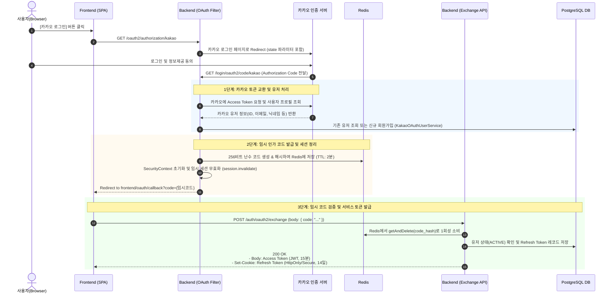

# 🔐 프로젝트 OAuth 2.0 구현 및 보안 아키텍처 학습 가이드

본 문서는 현재 프로젝트에 구현된 **OAuth 2.0 (카카오 소셜 로그인) 및 자체 일회성 인가 코드(Authorization Code Relay) 기반 토큰 교환 시스템**의 동작 원리, 설계 배경, 핵심 보안 정책을 체계적으로 학습하기 위해 정리한 문서입니다.

---

## 📌 1. 아키텍처 개요 및 설계 배경

### 1.1 왜 일반적인 OAuth 구현과 다른가?
일반적인 튜토리얼에서는 Spring Security OAuth2 Client 로그인 완료 후 `AuthenticationSuccessHandler`에서 **곧바로 JWT Access Token과 Refresh Token을 브라우저 리다이렉트 URL 쿼리 파라미터(`?access_token=...`)에 담아 전달**하는 방식을 많이 사용합니다.

하지만 이는 심각한 보안 취약점을 유발합니다:
* 브라우저 방문 기록(History), 프록시 서버 및 웹 서버 Access Log에 민감한 JWT 토큰이 평문으로 영구 기록됨.
* 리다이렉트 과정에서 HTTP `Referer` 헤더를 통해 외부 도메인으로 토큰이 유출될 위험 존재.
* 프론트엔드 URL에 Refresh Token이 노출되면 세션 탈취 위험 증가.

### 1.2 본 프로젝트의 해결책: 자체 일회성 인가 코드 릴레이 (Internal Code Relay)
본 프로젝트는 **OAuth 인증 완료 후 브라우저에 토큰을 직접 주지 않고, 유효시간 2분의 예측 불가능한 일회성 임시 코드(`code`)만 전달**합니다.  
이후 프론트엔드가 백엔드 API(`POST /auth/oauth2/exchange`)를 호출하여 안전하게 Access Token(JSON 본문)과 Refresh Token(HttpOnly/Secure 쿠키)으로 맞바꿔가는 아키텍처를 채택했습니다.

---

## 🔄 2. 전체 인증 및 토큰 발급 흐름 (Sequence Diagram)



---

## 🧱 3. 핵심 컴포넌트별 역할 및 코드 분석

### 3.1 SecurityConfig: Dual SecurityFilterChain 구조
본 프로젝트는 **OAuth2 로그인용 체인**과 **REST API용 체인**을 분리하여 각기 다른 세션/보안 정책을 적용합니다.

* **`oauth2SecurityFilterChain` (`Order(1)`, `/oauth2/**`, `/login/oauth2/**`)**:
  * OAuth2 인가 요청과 콜백 사이의 CSRF `state` 검증을 위해 일시적으로 세션을 허용합니다 (`SessionCreationPolicy.IF_REQUIRED`).
  * 로그인 엔드포인트는 외부 제공자(카카오)와의 브라우저 이동이므로 CSRF 검사를 비활성화합니다.
* **`apiSecurityFilterChain` (`Order(2)`, 나머지 모든 API)**:
  * 완전한 무상태(`SessionCreationPolicy.STATELESS`)를 유지합니다.
  * Cookie-to-Header 기반 CSRF 방어(`CookieCsrfTokenRepository` + `SpaCsrfTokenRequestHandler`) 및 JWT 인증 필터(`JwtFilter`)를 적용합니다.

---

### 3.2 CustomOAuth2UserService & KakaoOAuthUserService (유저 동기화)
* **`CustomOAuth2UserService`**:
  * Spring Security의 `OAuth2UserService` 표준 구현체.
  * 카카오 응답 JSON의 `kakao_account`, `profile` 중첩 구조를 안전하게 파싱하여 `KakaoUserInfo` Record로 정규화합니다.
* **`KakaoOAuthUserService`**:
  * **계정 자동 연동 방지**: 이미 `LOCAL` 등 다른 방식으로 가입된 동일 이메일이 존재하면 자동 병합하지 않고 `AUTH_005` 예외를 발생시킵니다 (보안 규칙 준수).
  * **닉네임 충돌 방지**: 카카오 닉네임이 우리 DB에 이미 존재하면 `사용자_XXXXXXXX` 형태의 임시 닉네임을 난수로 부여하고 `profileSetupRequired = true` 플래그를 설정하여 프론트엔드에 추가 프로필 설정을 유도합니다.

---

### 3.3 OAuth2AuthenticationSuccessHandler (인가 코드 발급 및 세션 정리)
카카오 로그인이 완료되는 즉시 호출됩니다.

```java
// 1. 임시 인가 코드 발급 (Redis 저장)
String code = authorizationCodeService.issue(kakaoUser.getUserId(), kakaoUser.isProfileSetupRequired());

// 2. 프론트엔드 콜백 URL 생성
String redirectUri = UriComponentsBuilder.fromUriString(properties.successRedirectUri())
        .queryParam("code", code)
        .build().encode().toUriString();

// 3. 중요한 보안 조치: OAuth 과정에서 생성된 서버 세션 및 SecurityContext 즉시 파기
SecurityContextHolder.clearContext();
HttpSession session = request.getSession(false);
if (session != null) {
    session.invalidate();
}

// 4. 프론트엔드로 리다이렉트
response.sendRedirect(redirectUri);
```

---

### 3.4 OAuthAuthorizationCodeService (Redis 기반 일회성 코드 관리)
* **Opaque Token Generator**: `SecureRandom`을 사용하여 암호학적으로 안전한 256비트(32바이트) Base64URL 난수를 생성합니다.
* **해시 기반 Redis 키 관리**: 원본 코드가 노출되거나 Redis가 탈취되더라도 역추적할 수 없도록 **SHA-256으로 해시한 값(`auth:oauth2:code:{hash}`)을 Redis Key**로 사용합니다.
* **원자적 1회 소비 (Atomic Single-Use)**: `redisTemplate.opsForValue().getAndDelete(key)` 명령어를 사용하여 코드를 조회하는 즉시 삭제합니다. 동시성 공격이나 코드 재사용 시도를 원천 차단합니다.
* **짧은 TTL**: 2분의 짧은 만료 시간을 부여합니다.

---

### 3.5 OAuthTokenExchangeService & AuthController (토큰 교환)
* 클라이언트가 `POST /auth/oauth2/exchange`로 `{ "code": "..." }`를 제출하면 동작합니다.
* Redis에서 인가 코드를 검증 및 소모하고 유저 상태를 확인합니다.
* **Access Token (JWT)**: 만료시간 15분, 응답 Body에 담아 전달.
* **Refresh Token (Opaque Token)**: 만료시간 14일, DB에 SHA-256 해시로 저장 후 클라이언트에는 `Set-Cookie` 헤더(`HttpOnly=true`, `Secure=true`, `SameSite=Strict`)로 전달.

---

## 🔒 4. 주요 보안 불변식 (Security Invariants) 정리

| 항목 | 구현 내용 | 보안적 이유 |
| :--- | :--- | :--- |
| **토큰 URL 비노출** | 일회성 코드 릴레이 방식 적용 | 브라우저 히스토리, 웹서버 로그, Referer 헤더를 통한 토큰 유출 방어 |
| **코드 일회성 보장** | Redis `getAndDelete` 원자적 실행 | 동일 코드를 사용한 Replay Attack(재전송 공격) 방지 |
| **코드 저장소 해싱** | SHA-256 해시 키로 Redis 저장 | 인메모리 DB 유출 시 코드 탈취 방지 |
| **세션 즉시 무효화** | SuccessHandler에서 `session.invalidate()` | OAuth2 로그인 과정 중 생성된 임시 세션 잔존 방지 |
| **소셜 계정 격리** | 타 Provider 계정과 자동 병합 금지 | 타인 이메일 도용을 통한 무단 계정 탈취(Account Takeover) 방지 |
| **토큰 분리 전달** | Access Token(Body) + Refresh Token(HttpOnly Cookie) | XSS 및 CSRF 공격 표면 최소화 |

---

## 💡 5. 학습 포인트 및 질의응답 (Q&A)

### Q1. 프론트엔드가 카카오와 직접 통신하지 않고 왜 백엔드를 거치나요?
* 카카오의 `Client Secret`은 외부에 노출되면 안 되는 비밀키이므로 프론트엔드(브라우저)에 둘 수 없습니다.
* 백엔드가 중개 역할을 수행함으로써 안전하게 비밀키를 보호하고, 우리 서비스 DB의 유저 테이블과 트랜잭션을묶어 원자적으로 처리할 수 있습니다.

### Q2. Redis 대신 RDBMS에 인가 코드를 저장하면 안 되나요?
* RDBMS에 저장할 수도 있지만, 인가 코드는 수명이 매우 짧고(2분) 조회가 빈번하게 발생합니다.
* Redis의 **TTL 만료 자동 삭제 기능**과 **`getAndDelete` 원자적 명령어**를 활용하면 별도의 스케줄러 배치 없이도 만료 데이터를 깔끔하게 정리하고 동시성 문제를 해결할 수 있습니다.

### Q3. `profileSetupRequired` 플래그는 왜 필요한가요?
* 카카오 닉네임이 기존 유저와 중복되거나 없는 경우, 가입은 정상 진행하되 임시 닉네임(`사용자_XXXX`)을 지정합니다.
* 이때 토큰 교환 응답에 `profileSetupRequired: true`를 함께 내려주어, 프론트엔드가 로그인 완료 후 "추가 닉네임 설정 페이지"로 사용자를 자연스럽게 안내할 수 있게 돕습니다.
