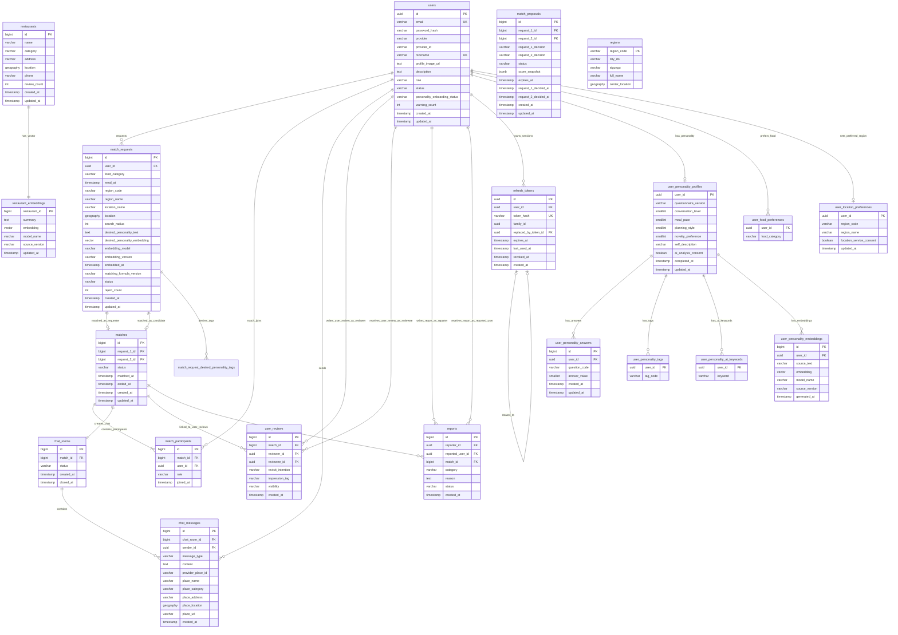

# 데이터베이스 모델링 및 설계 정의서 (PostgreSQL + PostGIS + pgvector + Redis)

본 문서는 MVP 범위인 실시간 1:1 맛집 매칭 서비스의 데이터베이스 설계를 정의합니다.
영구 저장소로는 **PostgreSQL**과 공간 연산 확장 모듈인 **PostGIS**, AI 기반 식당 추천 및 자유 서술 성향의 보조 랭킹을 위한 **pgvector**를 사용하며, 실시간 매칭 상태 관리 및 만료 처리 등 휘발성 상태 관리를 위해 **Redis**를 함께 활용합니다.

전체 구조만 빠르게 확인할 때는 [`스키마요약.md`](./스키마요약.md)를 먼저 참고합니다. 정확한 설명과 DDL의 최종 기준은 이 문서입니다.

---

## 1. 설계 개요

1. **영구 데이터베이스**: PostgreSQL (Supabase)
   - 사용자 계정과 Refresh Token 세션, 위치·성향 정보, 실시간 1:1 매칭 요청·결과·참여자, 채팅방/메시지, 식당 추천 정보와 사용자 후기 등 장기 보존이 필요한 데이터를 관리합니다.
2. **위치 데이터 처리 (PostGIS)**:
   - 사용자의 실시간 현재 위치는 개인정보 보호 및 데이터 정밀성 유지를 위해 `USER` 테이블에 저장하지 않습니다.
   - 사용자가 선택한 구 단위 기본 활동지역은 `USER_LOCATION_PREFERENCE`에 행정구역 코드와 표시명으로만 저장합니다.
   - 프론트엔드는 구 대표 좌표로 지도를 초기화하고, 사용자가 확정한 핀은 실시간 1:1 매칭 요청(`MATCH_REQUEST.location`)에만 `GEOGRAPHY(POINT, 4326)`로 저장합니다.
   - GIST 공간 인덱스를 활용하여 반경 검색(`ST_DWithin`) 및 거리 계산을 효율적으로 수행합니다.
3. **AI 추천 (pgvector)**:
   - 외부 식당 정보의 요약 텍스트를 임베딩 벡터로 변환하여 `RESTAURANT_EMBEDDING` 테이블에 저장합니다.
   - 사용자가 명시적으로 동의한 자유 서술 성향은 `USER_PERSONALITY_EMBEDDING`에 저장하며, 위치·시간 등 하드 필터를 통과한 후보의 보조 랭킹에만 사용합니다.
   - Cosine Similarity(`vector_cosine_ops`) 기반의 HNSW 인덱스를 설정하여 유사 식당 추천과 자유 서술 성향 후보 랭킹을 최적화합니다.
4. **실시간/휘발성 데이터 관리 (Redis)**:
   - 실시간 매칭 대기열, 매칭 매칭 대기 후보군 탐색, 실시간 이벤트 알림(Pub/Sub), 매칭 요청의 TTL(만료 시간)은 **Redis**에서 전담하여 처리합니다.
   - PostgreSQL에는 임시 상태(예: 매칭 대기 중인 사용자의 세부 정보, 요청 만료 시각 `expires_at` 등)를 불필요하게 중복 저장하지 않고, 최종 결과물 및 변경 이력만 동기화하여 저장합니다.

---

## 2. 개념적 설계 (Conceptual Design)

### 2.1 핵심 개체와 컬렉션 테이블 목록

| 번호 | 개체명 | 물리 테이블명 | 설명 |
| :--- | :--- | :--- | :--- |
| 1 | 사용자 | `users` | 서비스 이용자 정보 |
| 2 | 실시간 매칭 요청 | `match_requests` | 실시간 1:1 매칭 요청 정보 및 진행 이력 |
| 3 | 최종 1:1 매칭 | `matches` | 두 실시간 매칭 요청을 연결한 최종 결과 |
| 4 | 매칭 참여자 | `match_participants` | 최종 매칭에 참여하는 정확히 두 사용자 |
| 5 | 채팅방 | `chat_rooms` | 매칭 성공 시 생성되는 1:1 채팅방 |
| 6 | 채팅 메시지 | `chat_messages` | 채팅방 내부에서 송수신된 메시지 내역 |
| 7 | 식당 | `restaurants` | 매칭 및 추천의 대상이 되는 식당 기본 정보 |
| 8 | 식당 임베딩 | `restaurant_embeddings` | AI 식당 추천에 활용되는 외부 식당 정보 임베딩 |
| 9 | 사용자 후기 | `user_reviews` | 매칭 상대방에 대해 작성한 재만남 의향·인상 태그 후기 |
| 10 | Refresh Token | `refresh_tokens` | 로그인 세션별 Refresh Token 해시, 만료·회전·폐기 이력 |
| 11 | 사용자 성향 프로필 | `user_personality_profiles` | 자가 응답에서 계산한 버전별 정형 성향 점수 |
| 12 | 사용자 성향 응답 | `user_personality_answers` | 재계산과 사용자 수정에 필요한 설문 응답 |
| 13 | 사용자 성향 태그 | `user_personality_tags` | 성향 프로필의 `@ElementCollection` 스타일 태그 |
| 14 | 사용자 음식 선호 | `user_food_preferences` | 사용자의 `@ElementCollection` 음식 카테고리 |
| 15 | 사용자 성향 임베딩 | `user_personality_embeddings` | 동의한 자유 서술 성향의 보조 랭킹 벡터 (1NF 1:N 구조) |
| 16 | 사용자 기본 활동지역 | `user_location_preferences` | 구 단위 활동지역과 위치 기반 서비스 동의 |
| 17 | 매칭 요청 희망 성향 태그 | `match_request_desired_personality_tags` | 매칭 요청별 원하는 상대의 `PersonalityTag` 목록 |
| 18 | 사용자 AI 성향 키워드 | `user_personality_ai_keywords` | 성향 프로필의 `@ElementCollection` AI 추출 키워드 목록 |
| 19 | 신고 및 제재 | `reports` | 불량 이용자 신고 접수 및 관리자 조치 내역 |
| 20 | 행정구역 기준 데이터 | `regions` | 지원하는 구 단위 행정구역 시·군·구 코드, 표시명 및 대표 좌표 |

### 2.2 관계 요약 (Relationship)

- **USER**: 
  - `users` (1) : (N) `match_requests`
  - `users` (1) : (N) `match_participants`
  - `users` (1) : (N) `chat_messages`
  - `users` (1) : (N) `user_reviews` (작성자 `reviewer` / 대상자 `reviewee`)
  - `users` (1) : (N) `reports` (신고자 `reporter` / 피신고자 `reported_user`)
  - `users` (1) : (N) `refresh_tokens`
  - `users` (1) : (0..1) `user_personality_profiles`
  - `users` (1) : (N) `user_food_preferences`
  - `users` (1) : (0..1) `user_location_preferences`
- **PERSONALITY**:
  - `user_personality_profiles` (1) : (N) `user_personality_answers`
  - `user_personality_profiles` (1) : (N) `user_personality_tags`
  - `user_personality_profiles` (1) : (N) `user_personality_ai_keywords`
  - `user_personality_profiles` (1) : (N) `user_personality_embeddings` (1NF 원자화 1:N 관계)
- **MATCH_REQUEST**:
  - `match_requests` (1) : (N) `match_request_desired_personality_tags`
  - `matches.request_1_id`, `matches.request_2_id`가 서로 다른 두 `match_requests`를 정렬된 순서(`request_1_id < request_2_id`)로 참조합니다.
  - 하나의 요청은 최대 한 번만 최종 매칭에 사용됩니다.
- **MATCH**:
  - `matches` (1) : (2) `match_participants` (서비스 계층에서 정확히 두 명 보장)
  - `matches` (1) : (1) `chat_rooms` (1:1 대응 관계)
  - `matches` (1) : (N) `user_reviews`
  - `matches` (1) : (N) `reports`
- **CHAT**:
  - `chat_rooms` (1) : (N) `chat_messages`
- **RESTAURANT**:
  - `restaurants` (1) : (1) `restaurant_embeddings` (1:1 대응 관계)
- **REGION**:
  - `regions` (1) : (N) `user_location_preferences` 및 `match_requests` (행정구역 코드로 참조 및 대표 좌표 제공)

---

### 2.3 ERD (Entity Relationship Diagram)



---

## 3. 논리적 설계 (Logical Design)

### 3.1 위치 데이터 저장 원칙
- **사용자 위치 미저장**: `users` 테이블에는 사용자의 실시간 현재 위치를 보관하지 않습니다.
- **구 단위 기본 활동지역**: `user_location_preferences`에는 구 단위 행정구역 코드, 표시명, 위치 기반 서비스 동의만 저장합니다. 이는 실시간 위치가 아니라 사용자가 선택한 활동지역입니다.
- **지도 초기화**: 클라이언트는 저장된 구의 대표 좌표를 행정구역 기준 데이터에서 조회하여 지도 중심으로 사용합니다. Geolocation API에 의존하지 않습니다.
- **매칭 요청 지역 분리**: 기본 활동지역은 지도 초기 위치를 정하는 기본값이며 매칭 요청의 선택 구를 제한하지 않습니다. 매칭 요청마다 사용자가 선택한 `region_code`와 핀을 별도로 저장할 수 있습니다.
- **필요 시점의 저장**:
  - 실시간 매칭 요청에서 사용자가 확정한 핀: `match_requests.location`
  - 음식점 주소 위치: `restaurants.location`
- **행정구역 검증**: 요청의 `region_code`와 핀 좌표를 역지오코딩하거나 행정구역 경계 데이터로 비교하여 핀이 선택 구에 속하는지 검증합니다. 클라이언트가 보낸 `region_name`은 신뢰하지 않고 서버의 기준 데이터로 정규화합니다.
- **조회/반경 검색**: PostGIS 함수(`ST_DWithin`, `ST_Distance` 등)를 사용하여 쿼리 시점에 계산합니다.
- **거리 의미**: 계산 결과는 실제 사용자 위치 간 거리가 아니라 각 사용자가 확정한 핀 또는 조회 기준 핀 사이의 거리입니다.

### 3.2 Redis와 DB(PostgreSQL)의 역할 분담
- **Redis 관리 대상**:
  - 실시간 매칭 요청의 생명 주기 관리 및 매칭 매치메이킹 큐
  - 5분 대기 시간(TTL) 및 사용자별 매칭 진행 대기 상태(`match:user:{user_id}`), 제안 확인 중에는 제안 TTL 동안 사용자 잠금을 유지
  - 요청별 대기 키(`match:waiting:{request_id}`), Geo 인덱스(`match:waiting:geo`)와 개별 Geo TTL 보조 키
  - 후보 제안 ID만 담은 15초 TTL 보조 키(`match:proposal:{proposal_id}`)
  - 실시간 이벤트 알림 처리를 위한 Pub/Sub 메시지 채널
- **PostgreSQL 저장 대상**:
  - Redis의 대기 상태를 제외한, 최종 매칭 성공/실패 이력 로그 (`match_requests` 테이블에 저장되어 감사/통계용으로 활용)
  - `expires_at`과 같은 일시적인 세션 성격의 정보는 DB에 중복 저장하지 않습니다.

Redis 키 만료·유실과 DB 상태가 어긋날 수 있으므로 주기적 보정 작업이 `WAITING` 요청을 잠금 조회합니다. DB 기준 대기 시간이 남아 있으면 요청 위치로 Redis 대기 키와 Geo 멤버를 재등록하고, 시간이 끝났으면 DB를 `EXPIRED`로 변경한 뒤 Redis 데이터를 정리합니다. Redis 장애 중에는 DB 상태를 임의로 변경하지 않습니다.

---

### 3.3 테이블별 논리 명세

#### 1. `users` (사용자)
- 회원 기본 정보 및 상태를 관리합니다.

| 컬럼명 | 논리 타입 | 제약 조건 | 설명 |
| :--- | :--- | :--- | :--- |
| `id` | UUID | PK, DEFAULT `uuid_generate_v4()` | 사용자 식별 고유키 |
| `email` | VARCHAR(255) | UNIQUE, NOT NULL | 이메일 주소 (인증용 식별자) |
| `password_hash` | VARCHAR(255) | NULL | Argon2로 해싱한 비밀번호. 카카오·Google OAuth2 전용 계정은 NULL이며 원문 비밀번호는 저장하지 않음 |
| `provider` | VARCHAR(20) | NOT NULL, DEFAULT `LOCAL` | 가입 방식 (`LOCAL`, `KAKAO`, `GOOGLE`) |
| `provider_id` | VARCHAR(255) | NULL | OAuth 제공자가 발급한 고유 사용자 ID. LOCAL 계정은 NULL |
| `nickname` | VARCHAR(100) | UNIQUE, NOT NULL | 사용자 닉네임 |
| `profile_image_url` | TEXT | NULL | 프로필 이미지 URL |
| `description` | TEXT | NULL | 자기소개 및 한 줄 평 |
| `role` | VARCHAR(20) | NOT NULL | 회원 권한 (`USER`, `ADMIN`) |
| `status` | VARCHAR(20) | NOT NULL | 회원 활동 상태 (`ACTIVE`, `WITHDRAWN`) |
| `personality_onboarding_status` | VARCHAR(20) | NOT NULL, DEFAULT `NOT_STARTED` | 식사 스타일 온보딩 상태 (`NOT_STARTED`, `SKIPPED`, `COMPLETED`) |
| `created_at` | TIMESTAMPTZ | NOT NULL | 가입 일시 |
| `updated_at` | TIMESTAMPTZ | NOT NULL | 정보 수정 일시 |

- *Unique Constraint*: `(provider, provider_id)` (OAuth 제공자별 사용자 고유 ID 중복 방지)
- *Check Constraint*: LOCAL 계정은 `password_hash`가 필수이고 `provider_id`는 NULL이어야 하며, KAKAO·GOOGLE 계정은 `password_hash`가 NULL이고 `provider_id`가 필수입니다.
- 동일 이메일이 다른 Provider로 이미 가입되어 있으면 자동으로 계정을 연결하지 않고 기존 가입 방식을 안내합니다.
- 이메일은 애플리케이션에서 앞뒤 공백 제거 및 소문자 정규화 후 저장하며, OAuth 이메일은 제공자 검증이 완료된 경우에만 저장합니다.
- OAuth 닉네임이 없거나 중복되면 애플리케이션에서 `사용자_{무작위 8자리}` 형식의 임시 닉네임을 생성합니다.

#### 2. `match_requests` (실시간 매칭 요청)
- 실시간 1:1 매칭 요청 기록을 저장합니다. 대기 상태 자체와 TTL 관리는 Redis가 수행합니다.

| 컬럼명 | 논리 타입 | 제약 조건 | 설명 |
| :--- | :--- | :--- | :--- |
| `id` | BIGINT | PK | 실시간 매칭 요청 고유 식별 번호 |
| `user_id` | UUID | FK -> `users.id`, NOT NULL | 매칭을 요청한 사용자 |
| `food_category` | VARCHAR(100) | NOT NULL | 희망 식음료 카테고리 |
| `meal_at` | TIMESTAMPTZ | NOT NULL | 희망 식사 일시 |
| `region_code` | VARCHAR(5) | NOT NULL | 서버가 관리하는 5자리 시·군·구 코드 |
| `region_name` | VARCHAR(100) | NOT NULL | 서버 기준 데이터로 정규화한 구 표시명 |
| `location_name` | VARCHAR(255) | NULL | 사용자가 확인한 핀의 장소명 또는 설명 |
| `location` | GEOGRAPHY(POINT, 4326) | NOT NULL | 선택 구 안에서 사용자가 확정한 희망 매칭 장소 핀 |
| `search_radius` | INT | NULL | 탐색 반경 (단위: 미터) |
| `desired_personality_text` | TEXT | NULL, 최대 300자 | 해당 요청에서 원하는 상대 성향에 대한 선택적 자유 서술 |
| `desired_personality_embedding` | vector(1536) | NULL | 희망 상대 자유 서술 임베딩 벡터. Hibernate `SqlTypes.VECTOR`로 매핑하며 1536차원·유한값을 검증합니다. |
| `embedding_model` | VARCHAR(100) | NULL | 임베딩 생성에 사용된 모델명 |
| `embedding_version` | VARCHAR(50) | NULL | 임베딩 파이프라인/문서 버전 |
| `embedded_at` | TIMESTAMPTZ | NULL | 임베딩 생성 완료 시각 |
| `matching_formula_version` | VARCHAR(50) | NULL | 매칭 결과 재현과 분석을 위한 호환도 산식 버전 |
| `status` | VARCHAR(20) | NOT NULL | 요청 상태 (`WAITING`, `CONFIRMING`, `MATCHED`, `CANCELLED`, `EXPIRED`) |
| `reject_count` | INT | NOT NULL, DEFAULT 0 | 거절 횟수 기록 (매칭 성사 실패 분석용) |
| `created_at` | TIMESTAMPTZ | NOT NULL | 요청 일시 |
| `updated_at` | TIMESTAMPTZ | NOT NULL | 상태 변경 일시 |

- *Check Constraint*: `search_radius`는 NULL이거나 양수이며 `reject_count`는 0 이상입니다.
- 희망 설명 임베딩 벡터, 모델명, 버전, 생성 시각은 모두 존재하거나 모두 NULL이어야 합니다.

#### 2-1. `match_request_desired_personality_tags` (매칭 요청 희망 성향 태그)
- `MatchRequest.desiredPersonalityTags`의 지연 로딩 `@ElementCollection` 테이블입니다. 요청 시점의 원하는 상대 성향 태그를 보존하며, 요청 DTO에서 3개 이상 5개 이하를 검증합니다.

| 컬럼명 | 논리 타입 | 제약 조건 | 설명 |
| :--- | :--- | :--- | :--- |
| `match_request_id` | BIGINT | FK -> `match_requests.id`, NOT NULL | 태그를 선택한 매칭 요청 |
| `tag_code` | VARCHAR(50) | NOT NULL, 문자열 Enum | `PersonalityTag` 코드 |

- *Unique Constraint*: `(match_request_id, tag_code)`

#### 2-2. `match_proposals` (실시간 후보 제안 및 양방향 수락)
- 조건이 일치하는 두 `MatchRequest` 간의 간략 프로필 제안 및 15초 내 상호 수락 결정을 관리합니다.

| 컬럼명 | 논리 타입 | 제약 조건 | 설명 |
| :--- | :--- | :--- | :--- |
| `id` | BIGINT | PK | 후보 제안 고유 식별 번호 |
| `request_1_id` | BIGINT | FK -> `match_requests.id`, NOT NULL | 제안에 포함된 작은 ID의 매칭 요청 |
| `request_2_id` | BIGINT | FK -> `match_requests.id`, NOT NULL | 제안에 포함된 큰 ID의 매칭 요청 |
| `request_1_decision` | VARCHAR(20) | NOT NULL | request1 소유자의 결정 (`PENDING`, `ACCEPTED`, `REJECTED`) |
| `request_2_decision` | VARCHAR(20) | NOT NULL | request2 소유자의 결정 (`PENDING`, `ACCEPTED`, `REJECTED`) |
| `status` | VARCHAR(20) | NOT NULL | 제안 상태 (`PENDING`, `MATCHED`, `REJECTED`, `EXPIRED`, `CANCELLED`) |
| `score_snapshot` | JSONB | NULL | 정렬된 요청 기준 `request1 → request2`, `request2 → request1` 점수·상위 일치 태그·사유, 최종 쌍 점수와 산식 버전 |
| `expires_at` | TIMESTAMPTZ | NOT NULL | 15초 수락 응답 제한 시간 |
| `request_1_decided_at`| TIMESTAMPTZ | NULL | request1 소유자의 응답 일시 |
| `request_2_decided_at`| TIMESTAMPTZ | NULL | request2 소유자의 응답 일시 |
| `created_at` | TIMESTAMPTZ | NOT NULL | 제안 생성 일시 |
| `updated_at` | TIMESTAMPTZ | NOT NULL | 최종 상태 갱신 일시 |

- *Check Constraint*: `request_1_id < request_2_id`
- *Check Constraint*: `MATCHED`는 양쪽 결정이 모두 `ACCEPTED`, `REJECTED`는 한쪽 이상이 `REJECTED`인 경우에만 허용합니다.
- *Unique Constraint*: `(request_1_id, request_2_id)`로 동일 요청 쌍의 중복 제안을 차단합니다.
- *Indexes*: `(status)`, `(request_1_id)`, `(request_2_id)`, `(expires_at)`
- 제안 결정은 `PENDING → ACCEPTED|REJECTED` 단방향으로만 변경하며 동일 결정 재요청만 멱등하게 허용합니다. `now >= expires_at`이면 새로운 결정을 받지 않습니다.

`score_snapshot` JSON은 `sourceToTargetScore`, `sourceToTargetMatchedTags`, `sourceToTargetReasons`와 `targetToSource...` 방향 필드, `pairScore`, `formulaVersion`을 보존합니다. 원본 설문 답변·자유 서술·임베딩 벡터·차원별 내부 점수는 저장하지 않습니다.

#### 3. `matches` (최종 1:1 매칭 결과)
- 서로 다른 두 실시간 매칭 요청이 최종 성사된 결과를 저장합니다.

| 컬럼명 | 논리 타입 | 제약 조건 | 설명 |
| :--- | :--- | :--- | :--- |
| `id` | BIGINT | PK | 최종 매칭 식별 고유키 |
| `request_1_id` | BIGINT | UNIQUE, FK -> `match_requests.id`, NOT NULL | 매칭된 두 요청 중 작은 ID의 요청 |
| `request_2_id` | BIGINT | UNIQUE, FK -> `match_requests.id`, NOT NULL | 매칭된 두 요청 중 큰 ID의 요청 |
| `status` | VARCHAR(20) | NOT NULL | 최종 매칭 상태 (`MATCHED`, `COMPLETED`, `CANCELLED`) |
| `matched_at` | TIMESTAMPTZ | NOT NULL | 매칭 성사 완료 일시 |
| `ended_at` | TIMESTAMPTZ | NULL | 매칭 종료 일시. 활성 `MATCHED` 상태에서는 NULL이며 종료 상태에서만 설정 |
| `created_at` | TIMESTAMPTZ | NOT NULL | 데이터 생성 시간 |
| `updated_at` | TIMESTAMPTZ | NOT NULL | 최종 수정 시간 |

- *Check Constraint*: `request_1_id < request_2_id` 및 `MATCHED` 상태의 `ended_at IS NULL`, `COMPLETED`·`CANCELLED` 상태의 `ended_at IS NOT NULL`.
- *Unique Constraint*: `(request_1_id, request_2_id)` (동일 요청 조합 중복 매칭 차단)
- 서비스 계층은 두 요청의 `user_id`가 서로 다르고 두 요청 모두 다른 활성 `MATCHED` 매칭에 사용되지 않았는지 요청 ID 오름차순 비관적 잠금과 같은 트랜잭션에서 검증합니다. 양쪽 수락이 확정된 경우에만 이 행과 참여자·채팅방을 원자적으로 저장하며, 중복 재시도는 기존 매칭 결과를 재사용합니다.
- 도메인 상태 전이는 `MATCHED -> COMPLETED` 또는 `MATCHED -> CANCELLED`만 허용하며, 종료 시각은 매칭 성사 시각보다 빠를 수 없습니다. 종료된 매칭은 다시 활성화할 수 없습니다.

#### 4. `match_participants` (1:1 매칭 참여자)
- 최종 성사된 매칭의 두 사용자를 관리합니다.

| 컬럼명 | 논리 타입 | 제약 조건 | 설명 |
| :--- | :--- | :--- | :--- |
| `id` | BIGINT | PK | 매칭 참여 고유 식별 번호 |
| `match_id` | BIGINT | FK -> `matches.id`, NOT NULL | 대상 매칭 정보 |
| `user_id` | UUID | FK -> `users.id`, NOT NULL | 소속된 참여 사용자 |
| `role` | VARCHAR(20) | NOT NULL | 매칭 참여자 역할 (`PARTICIPANT`) |
| `joined_at` | TIMESTAMPTZ | NOT NULL | 매칭 참여 합류 시간 |

- *Unique Constraint*: `(match_id, user_id)` (중복 합류 방지)
- 한 `match_id`에는 애플리케이션 서비스 계층에서 정확히 2개 참여자만 생성합니다. 매칭 확정 트랜잭션이 중간 저장에 실패하면 매칭·참여자·채팅방과 요청 상태가 함께 롤백됩니다.
- 기존 스키마에 구 역할 CHECK 제약이 남아 있다면 [`매칭_참여자_역할_및_ID_정합성.sql`](../migrations/매칭_참여자_역할_및_ID_정합성.sql)을 실행해 `PARTICIPANT` 역할과 ID 시퀀스를 정합화합니다.

#### 5. `chat_rooms` (채팅방)
- 성사된 매칭에 1:1 매핑되어 생성되는 채팅 대화방입니다.

| 컬럼명 | 논리 타입 | 제약 조건 | 설명 |
| :--- | :--- | :--- | :--- |
| `id` | BIGINT | PK | 채팅방 식별 번호 |
| `match_id` | BIGINT | FK -> `matches.id`, UNIQUE, NOT NULL | 매칭 고유 번호 (1:1 매핑) |
| `status` | VARCHAR(20) | NOT NULL | 채팅방 활성 여부 상태 (`ACTIVE`, `CLOSED`) |
| `created_at` | TIMESTAMPTZ | NOT NULL | 대화방 생성 일시 |
| `closed_at` | TIMESTAMPTZ | NULL | 대화방 영구 정지/종료 일시 |

- *Check Constraint*: `ACTIVE` 상태에서는 `closed_at IS NULL`, `CLOSED` 상태에서는 `closed_at IS NOT NULL`.
- 도메인 상태 전이는 `ACTIVE -> CLOSED`만 허용하며, 종료된 채팅방은 다시 활성화할 수 없습니다.

#### 6. `chat_messages` (채팅 메시지)
- 채팅방 내부에서 발송된 텍스트 또는 식당 공유 메시지 로그를 저장합니다.

| 컬럼명 | 논리 타입 | 제약 조건 | 설명 |
| :--- | :--- | :--- | :--- |
| `id` | BIGINT | PK | 메시지 고유 번호 |
| `chat_room_id` | BIGINT | FK -> `chat_rooms.id`, NOT NULL | 속한 채팅 대화방 |
| `sender_id` | UUID | FK -> `users.id`, NOT NULL | 메시지 송신한 회원 |
| `message_type` | VARCHAR(20) | NOT NULL, DEFAULT `TEXT` | 메시지 유형 (`TEXT`, `PLACE`) |
| `content` | TEXT | NOT NULL | 메시지 본문 내용 |
| `provider_place_id` | VARCHAR(30) | NULL | `PLACE` 메시지의 Kakao 장소 ID |
| `place_name` | VARCHAR(200) | NULL | 공유 시점 식당 이름 스냅샷 |
| `place_category` | VARCHAR(200) | NULL | 공유 시점 카테고리 스냅샷 |
| `place_address` | VARCHAR(500) | NULL | 공유 시점 주소 스냅샷 |
| `place_location` | GEOGRAPHY(POINT, 4326) | NULL | 공유 식당 좌표(경도, 위도 순) |
| `place_url` | VARCHAR(300) | NULL | 서버가 Kakao 장소 ID로 생성한 상세 URL |
| `created_at` | TIMESTAMPTZ | NOT NULL | 전송 시각 |

- `TEXT`는 모든 장소 컬럼이 `NULL`이어야 하며, `PLACE`는 모든 장소 컬럼이 `NOT NULL`이어야 합니다.

#### 7. `restaurants` (식당 정보)
- 서비스에 등록되어 있는 식당 및 카페 등 요식업체의 정보입니다.

| 컬럼명 | 논리 타입 | 제약 조건 | 설명 |
| :--- | :--- | :--- | :--- |
| `id` | BIGINT | PK | 식당 등록 고유 번호 |
| `name` | VARCHAR(255) | NOT NULL | 식당 한글/영어 명칭 |
| `category` | VARCHAR(100) | NOT NULL | 음식점 세부 분류 카테고리 |
| `address` | VARCHAR(500) | NOT NULL | 도로명/지번 공식 상세 주소 |
| `location` | GEOGRAPHY(POINT, 4326) | NOT NULL | 식당 위경도 위치 좌표 |
| `phone` | VARCHAR(50) | NULL | 식당 연락처 번호 |
| `review_count` | INT | NOT NULL, DEFAULT 0 | 외부 식당 정보 제공처의 리뷰 누적 개수 |
| `created_at` | TIMESTAMPTZ | NOT NULL | 식당 DB 최초 등록 시점 |
| `updated_at` | TIMESTAMPTZ | NOT NULL | 식당 정보 마지막 수정 시점 |

#### 8. `restaurant_embeddings` (식당 임베딩)
- 외부 식당 정보 제공처에서 수집한 설명·메뉴·평점 요약을 이용한 AI 식당 추천용 임베딩 테이블입니다. pgvector를 이용합니다.

| 컬럼명 | 논리 타입 | 제약 조건 | 설명 |
| :--- | :--- | :--- | :--- |
| `restaurant_id` | BIGINT | PK, FK -> `restaurants.id` | 대상 식당 고유 번호 (1:1 관계) |
| `summary` | TEXT | NULL | 외부 식당 정보의 추천용 요약본 |
| `embedding` | VECTOR(1536) | NOT NULL | AI 분석용 임베딩 벡터값 |
| `model_name` | VARCHAR(100) | NOT NULL | 임베딩 생성 모델 식별자 |
| `source_version` | VARCHAR(100) | NOT NULL | 외부 데이터 및 정규화 규칙 버전 |
| `updated_at` | TIMESTAMPTZ | NOT NULL | 임베딩 벡터 최종 업데이트/갱신 시각 |

#### 9. `user_reviews` (사용자 후기)
- 식사 후 매칭 상대방에 대한 재만남 의향과 선택 인상 태그만 기록합니다. 기존 `rating`·`content` 컬럼은 사용하지 않으므로 명시적 마이그레이션으로 제거합니다.

| 컬럼명 | 논리 타입 | 제약 조건 | 설명 |
| :--- | :--- | :--- | :--- |
| `id` | BIGINT | PK | 후기 식별 번호 |
| `match_id` | BIGINT | FK -> `matches.id`, NOT NULL | 매칭 정보 |
| `reviewer_id` | UUID | FK -> `users.id`, NOT NULL | 후기를 작성한 사용자 |
| `reviewee_id` | UUID | FK -> `users.id`, NOT NULL | 평가 대상이 되는 상대 사용자 |
| `revisit_intention` | VARCHAR(30) | NOT NULL | 재만남 의향 고정 코드 (`DEFINITELY_AGAIN`, `MAYBE_AGAIN`, `ENOUGH_FOR_NOW`) |
| `impression_tag` | VARCHAR(30) | NULL | 선택 인상 태그 고정 코드 (`PUNCTUAL`, `COMFORTABLE_CONVERSATION`, `CONSIDERATE`, `ACTIVE_PARTICIPATION`) |
| `visibility` | VARCHAR(20) | NOT NULL | 타인에게 노출 여부 (`PUBLIC`: 공개, `PRIVATE`: 비공개/시스템 분석용) |
| `created_at` | TIMESTAMPTZ | NOT NULL | 작성 일시 |

- *Unique Constraint*: `(match_id, reviewer_id, reviewee_id)` (동일 매칭 상대에게 중복 후기 작성 방지)
- *Check Constraint*: `revisit_intention`은 세 고정 코드 중 하나이고 `impression_tag`는 NULL 또는 네 고정 코드 중 하나이며, 작성자와 평가 대상은 서로 달라야 하고 `visibility`는 `PUBLIC` 또는 `PRIVATE`여야 합니다.
- 다시한끼 지수의 집계 대상은 `visibility = PUBLIC`인 유효 후기뿐입니다. 삭제·신고 승인·운영상 무효화 상태를 도입할 때는 동일한 유효성 조건에서 제외하도록 운영 후속 정책을 따릅니다.
- `rating`·`content` 제거 전에는 해당 컬럼에 값이 남아 있지 않은지 확인하며, 상세 절차는 [`docs/migrations/사용자_후기_컬럼_전환.sql`](../migrations/사용자_후기_컬럼_전환.sql)을 따릅니다.

#### 10. `refresh_tokens` (Refresh Token 세션)
- Access Token 재발급, 로그아웃, 토큰 회전 및 재사용 탐지를 위한 로그인 세션 정보를 관리합니다.
- Refresh Token 원문은 클라이언트의 Secure/HttpOnly 쿠키에만 전달하고 서버에는 SHA-256 해시만 저장합니다.

| 컬럼명 | 논리 타입 | 제약 조건 | 설명 |
| :--- | :--- | :--- | :--- |
| `id` | UUID | PK, DEFAULT `uuid_generate_v4()` | Refresh Token 레코드 식별자 |
| `user_id` | UUID | FK -> `users.id`, NOT NULL | 토큰 소유 사용자 |
| `token_hash` | VARCHAR(64) | UNIQUE, NOT NULL | Refresh Token 원문을 SHA-256으로 해싱한 16진수 문자열 |
| `family_id` | UUID | NOT NULL | 한 로그인 세션에서 회전된 토큰을 묶는 식별자 |
| `replaced_by_token_id` | UUID | FK -> `refresh_tokens.id`, NULL | Rotation으로 이 토큰을 대체한 새 토큰 |
| `expires_at` | TIMESTAMPTZ | NOT NULL | Refresh Token 절대 만료 시각 |
| `last_used_at` | TIMESTAMPTZ | NULL | 마지막 재발급 사용 시각 |
| `revoked_at` | TIMESTAMPTZ | NULL | 로그아웃·회원탈퇴·재사용 탐지로 폐기된 시각 |
| `created_at` | TIMESTAMPTZ | NOT NULL | 토큰 발급 시각 |

- 재발급 시 기존 토큰의 `revoked_at`과 `replaced_by_token_id`를 기록하고 같은 `family_id`로 새 토큰을 발급합니다.
- 이미 폐기된 토큰이 다시 사용되면 같은 `family_id`의 활성 토큰을 모두 폐기합니다.
- 사용자당 최대 5개의 활성 세션(family)을 허용하며, 초과 로그인 시 가장 오래된 활성 세션부터 `revoked_at`을 기록하여 폐기합니다.
- 만료 토큰은 RTR 재사용 탐지 보장을 위해 만료 후 7일간 보관 후, 매일 04:00(KST) 스케줄러를 통해 물리 삭제(Hard Delete)됩니다. (`expires_at < now() - 7 days`)

#### 11. `user_personality_profiles` (사용자 성향 프로필)
- 자가 응답을 버전된 서버 규칙으로 계산한 정형 점수만 저장합니다. 값의 범위는 0~100이며 심리 진단 결과로 사용하지 않습니다.

| 컬럼명 | 논리 타입 | 제약 조건 | 설명 |
| :--- | :--- | :--- | :--- |
| `user_id` | UUID | PK, FK -> `users.id` | 성향 프로필 소유 사용자 |
| `questionnaire_version` | VARCHAR(50) | NOT NULL, `MEAL_PERSONALITY_V1` | 점수 재계산을 위한 설문·산식 버전 |
| `conversation_level` | SMALLINT | NOT NULL, 0~100 | 식사 중 선호 대화량 |
| `meal_pace` | SMALLINT | NOT NULL, 0~100 | 선호 식사 속도 |
| `planning_style` | SMALLINT | NOT NULL, 0~100 | 즉흥형과 계획형 사이의 자가 응답 점수 |
| `novelty_preference` | SMALLINT | NOT NULL, 0~100 | 새로운 음식·장소 선호 정도 |
| `self_description` | VARCHAR(100) | NULL | AI 분석에 동의한 사용자의 선택형 자기 스타일 설명 (최대 100자) |
| `ai_analysis_consent` | BOOLEAN | NOT NULL, DEFAULT FALSE | 자유 서술 AI 분석에 대한 현재 동의 여부 |
| `completed_at` | TIMESTAMPTZ | NOT NULL | 현재 버전 설문 완료 시각 |
| `updated_at` | TIMESTAMPTZ | NOT NULL | 점수 또는 동의 변경 시각 |

#### 12. `user_personality_answers` (사용자 성향 응답)
- 프로필 재계산과 사용자의 답변 수정에 필요한 정형 응답을 저장합니다.

| 컬럼명 | 논리 타입 | 제약 조건 | 설명 |
| :--- | :--- | :--- | :--- |
| `id` | BIGINT | PK | 응답 식별 번호 |
| `user_id` | UUID | FK -> `user_personality_profiles.user_id`, NOT NULL | 응답 사용자 |
| `question_code` | VARCHAR(100) | NOT NULL, 문자열 Enum | 버전 내 네 가지 성향 차원 코드 |
| `answer_value` | SMALLINT | NOT NULL, `1`, `3`, `5` | 낮음·중간·높음 카드의 정형 응답 값 |
| `created_at` | TIMESTAMPTZ | NOT NULL | 최초 응답 시각 |
| `updated_at` | TIMESTAMPTZ | NOT NULL | 응답 수정 시각 |

- *Unique Constraint*: `(user_id, question_code)`

#### 13. `user_personality_tags` (사용자 성향 태그)
- `UserPersonalityProfile.styleTags`의 지연 로딩 `@ElementCollection` 테이블입니다. 점수만으로 표현하기 어려운 세부 식사 스타일을 최대 5개까지 저장합니다.

| 컬럼명 | 논리 타입 | 제약 조건 | 설명 |
| :--- | :--- | :--- | :--- |
| `user_id` | UUID | FK -> `user_personality_profiles.user_id`, NOT NULL | 태그 소유 성향 프로필 |
| `tag_code` | VARCHAR(50) | NOT NULL, 문자열 Enum | `PersonalityTag` 코드 |

- *Unique Constraint*: `(user_id, tag_code)`
- 최대 5개 제한은 API DTO와 서비스 계층에서 검증합니다.

#### 13-1. `user_personality_ai_keywords` (사용자 AI 성향 키워드)
- `UserPersonalityProfile.aiKeywords`의 지연 로딩 `@ElementCollection` 테이블입니다. AI 분석 결과 추출된 식사 스타일 키워드를 저장합니다.

| 컬럼명 | 논리 타입 | 제약 조건 | 설명 |
| :--- | :--- | :--- | :--- |
| `user_id` | UUID | FK -> `user_personality_profiles.user_id`, NOT NULL | 키워드 소유 성향 프로필 |
| `keyword` | VARCHAR(100) | NOT NULL | AI 분석 추출 키워드 문자열 |

#### 14. `user_food_preferences` (사용자 음식 선호)
- `User.foodPreferences`의 지연 로딩 `@ElementCollection` 테이블입니다. 성향 점수·태그와 분리하여 음식 카테고리를 최대 5개까지 저장합니다.

| 컬럼명 | 논리 타입 | 제약 조건 | 설명 |
| :--- | :--- | :--- | :--- |
| `user_id` | UUID | FK -> `users.id`, NOT NULL | 음식 선호 소유 사용자 |
| `food_category` | VARCHAR(50) | NOT NULL, 문자열 Enum | `FoodCategory` 코드 |

- *Unique Constraint*: `(user_id, food_category)`
- 최대 5개 제한은 API DTO와 서비스 계층에서 검증합니다.

#### 15. `user_personality_embeddings` (사용자 성향 임베딩)
- 사용자가 AI 분석에 동의한 자유 서술만 임베딩하고 하드 필터 이후 보조 랭킹에 사용합니다.
- JPA의 `float[]` 필드는 Hibernate Vector 모듈을 통해 PostgreSQL `vector(1536)` 타입으로 바인딩합니다.
- 1차 정규화(1NF) 원칙 적용: 다중 속성 묶음 대신 개별 정제 키워드 단어 1개 ↔ 임베딩 1개의 원자화된 1:N 레코드로 독립 보관하며, 동의 철회 시 일괄 삭제합니다.

| 컬럼명 | 논리 타입 | 제약 조건 | 설명 |
| :--- | :--- | :--- | :--- |
| `id` | BIGINT | PK, GENERATED ALWAYS AS IDENTITY | 레코드 고유 식별 번호 |
| `user_id` | UUID | FK -> `user_personality_profiles.user_id`, NOT NULL | 임베딩 소유 사용자 |
| `source_text` | VARCHAR(100) | NOT NULL | 동의한 자기소개 자유 텍스트만 저장한 정제 키워드 단어 |
| `embedding` | VECTOR(1536) | NOT NULL | 문서화된 동일 모델로 생성한 벡터 |
| `model_name` | VARCHAR(100) | NOT NULL | 생성 모델 식별자 |
| `source_version` | VARCHAR(100) | NOT NULL | 공통 자유 텍스트 임베딩 입력·정규화 규칙 버전 (`PERSONALITY_FREE_TEXT_V2`) |
| `generated_at` | TIMESTAMPTZ | NOT NULL | 임베딩 생성 시각 |

#### 16. `user_location_preferences` (사용자 기본 활동지역)
- 사용자에게서 구 단위로 받은 기본 활동지역과 위치 기반 서비스 동의를 관리합니다. 실제 현재 위치나 상세 핀 좌표는 저장하지 않습니다.

| 컬럼명 | 논리 타입 | 제약 조건 | 설명 |
| :--- | :--- | :--- | :--- |
| `user_id` | UUID | PK, FK -> `users.id` | 기본 활동지역 소유 사용자 |
| `region_code` | VARCHAR(5) | NOT NULL | 서버가 지원하는 5자리 시·군·구 코드 |
| `region_name` | VARCHAR(100) | NOT NULL | 서버 기준 데이터로 정규화한 시·도 + 구 표시명 |
| `location_service_consent` | BOOLEAN | NOT NULL, DEFAULT FALSE | 선택 지역과 매칭 핀 저장을 포함한 위치 기반 서비스 동의 |
| `updated_at` | TIMESTAMPTZ | NOT NULL | 지역 또는 동의 변경 시각 |

- 행정구역 코드별 대표 좌표는 사용자 데이터가 아닌 기준 데이터로 관리하며 지도 초기 중심 설정에만 사용합니다.
- 동의 철회 시 이후 위치 기반 요청을 거부합니다. `WAITING`/`CONFIRMING` 활성 요청은 제안을 먼저 취소하고 상대 요청을 대기 상태로 복구한 뒤 Redis 대기 데이터와 함께 물리 삭제하여 정밀 핀·희망 설명·임베딩을 제거합니다. 이미 종료된 요청은 매칭 이력 보존 정책을 따릅니다.

#### 17. `reports` (신고 및 제재)
- 사용자가 불량 이용자를 신고하고 관리자가 검토하여 조치할 수 있도록 관리하는 테이블입니다.

| 컬럼명 | 논리 타입 | 제약 조건 | 설명 |
| :--- | :--- | :--- | :--- |
| `id` | BIGINT | PK, GENERATED ALWAYS AS IDENTITY | 신고 레코드 식별 번호 |
| `reporter_id` | UUID | FK -> `users.id`, NOT NULL | 신고를 작성한 회원 |
| `reported_user_id` | UUID | FK -> `users.id`, NOT NULL | 신고 대상 회원 |
| `match_id` | BIGINT | FK -> `matches.id`, NOT NULL | 신고가 발생한 매칭 |
| `category` | VARCHAR(50) | NOT NULL, 문자열 Enum | 신고 사유 카테고리 (`NO_SHOW`, `ABUSE`, `SPAM`, `MISINFORMATION`) |
| `reason` | TEXT | NOT NULL | 구체적인 신고 내용 |
| `status` | VARCHAR(20) | NOT NULL, DEFAULT `PENDING` | 신고 처리 상태 (`PENDING`, `DISMISSED`, `ACTIONED`) |
| `created_at` | TIMESTAMPTZ | NOT NULL | 신고 접수 일시 |

- 신고 행은 관리자 처리 후에도 삭제하지 않고 상태만 변경하여, 동일 사용자가 동일 매칭에서 신고를 다시 제출하지 못하도록 방지합니다.

#### 18. `regions` (행정구역 기준 데이터)
- 서비스에서 지원하는 구 단위 행정구역 코드, 표시명 및 지도 초기화용 대표 중심 좌표 데이터입니다.

| 컬럼명 | 논리 타입 | 제약 조건 | 설명 |
| :--- | :--- | :--- | :--- |
| `region_code` | VARCHAR(5) | PK | 5자리 시·군·구 행정구역 코드 |
| `city_do` | VARCHAR(50) | NOT NULL | 시/도 명칭 (예: 서울특별시) |
| `sigungu` | VARCHAR(50) | NOT NULL | 시/군/구 명칭 (예: 종로구) |
| `full_name` | VARCHAR(100) | NOT NULL | 시·도 + 구 정규화 표시명 |
| `center_location` | GEOGRAPHY(POINT, 4326) | NOT NULL | 지도 초기 핀 설정을 위한 구 대표 중심 좌표 |

---

## 4. 물리적 설계 및 DDL (Physical Design & DDL)

### 4.1 확장 프로그램 구성
- `postgis`: 공간 데이터 처리를 위해 활성화합니다.
- `vector`: pgvector를 활성화하여 식당 임베딩 및 코사인 유사도 검색 연산을 가능케 합니다.
- `uuid-ossp`: UUID 무작위 생성을 위해 활성화합니다.

```sql
CREATE EXTENSION IF NOT EXISTS "uuid-ossp";
CREATE EXTENSION IF NOT EXISTS postgis;
CREATE EXTENSION IF NOT EXISTS vector;
```

### 4.2 테이블 생성 SQL (DDL)

```sql
-- 1. 사용자 테이블 (users)
CREATE TABLE users (
    id UUID PRIMARY KEY DEFAULT uuid_generate_v4(),
    email VARCHAR(255) UNIQUE NOT NULL,
    password_hash VARCHAR(255),
    provider VARCHAR(20) NOT NULL DEFAULT 'LOCAL'
        CHECK (provider IN ('LOCAL', 'KAKAO', 'GOOGLE')),
    provider_id VARCHAR(255),
    nickname VARCHAR(100) UNIQUE NOT NULL,
    profile_image_url TEXT,
    description TEXT,
    role VARCHAR(20) NOT NULL CHECK (role IN ('USER', 'ADMIN')),
    status VARCHAR(20) NOT NULL CHECK (status IN ('ACTIVE', 'WITHDRAWN', 'BANNED')),
    personality_onboarding_status VARCHAR(20) NOT NULL DEFAULT 'NOT_STARTED'
        CHECK (personality_onboarding_status IN ('NOT_STARTED', 'SKIPPED', 'COMPLETED')),
    warning_count INT NOT NULL DEFAULT 0,
    created_at TIMESTAMPTZ NOT NULL DEFAULT NOW(),
    updated_at TIMESTAMPTZ NOT NULL DEFAULT NOW(),
    CONSTRAINT uk_users_provider_provider_id UNIQUE (provider, provider_id),
    CONSTRAINT chk_users_auth_provider CHECK (
        (provider = 'LOCAL' AND password_hash IS NOT NULL AND provider_id IS NULL) OR
        (provider IN ('KAKAO', 'GOOGLE') AND password_hash IS NULL AND provider_id IS NOT NULL)
    )
);

-- 2. 식당 테이블 (restaurants)
CREATE TABLE restaurants (
    id BIGINT GENERATED ALWAYS AS IDENTITY PRIMARY KEY,
    name VARCHAR(255) NOT NULL,
    category VARCHAR(100) NOT NULL,
    address VARCHAR(500) NOT NULL,
    location GEOGRAPHY(POINT, 4326) NOT NULL,
    phone VARCHAR(50),
    review_count INT NOT NULL DEFAULT 0,
    created_at TIMESTAMPTZ NOT NULL DEFAULT NOW(),
    updated_at TIMESTAMPTZ NOT NULL DEFAULT NOW()
);

-- 3. 외부 식당 정보 임베딩 (restaurant_embeddings)
-- 1536차원은 OpenAI의 text-embedding-3-small 등 최신 표준 임베딩 차원에 맞추었습니다.
CREATE TABLE restaurant_embeddings (
    restaurant_id BIGINT PRIMARY KEY REFERENCES restaurants(id) ON DELETE CASCADE,
    summary TEXT,
    embedding VECTOR(1536) NOT NULL,
    model_name VARCHAR(100) NOT NULL,
    source_version VARCHAR(100) NOT NULL,
    updated_at TIMESTAMPTZ NOT NULL DEFAULT NOW()
);

-- 4. 실시간 매칭 요청 테이블 (match_requests)
CREATE TABLE match_requests (
    id BIGINT GENERATED ALWAYS AS IDENTITY PRIMARY KEY,
    user_id UUID NOT NULL REFERENCES users(id) ON DELETE CASCADE,
    food_category VARCHAR(100) NOT NULL,
    meal_at TIMESTAMPTZ NOT NULL,
    region_code VARCHAR(5) NOT NULL,
    region_name VARCHAR(100) NOT NULL,
    location_name VARCHAR(255),
    location GEOGRAPHY(POINT, 4326) NOT NULL,
    search_radius INT,
    desired_personality_text TEXT,
    desired_personality_embedding vector(1536),
    embedding_model VARCHAR(100),
    embedding_version VARCHAR(50),
    embedded_at TIMESTAMPTZ,
    matching_formula_version VARCHAR(50),
    status VARCHAR(20) NOT NULL CHECK (status IN ('WAITING', 'CONFIRMING', 'MATCHED', 'CANCELLED', 'EXPIRED')),
    reject_count INT NOT NULL DEFAULT 0,
    created_at TIMESTAMPTZ NOT NULL DEFAULT NOW(),
    updated_at TIMESTAMPTZ NOT NULL DEFAULT NOW(),
    CONSTRAINT chk_match_requests_search_radius_reject_count CHECK (
        (search_radius IS NULL OR search_radius > 0) AND reject_count >= 0
    ),
    CONSTRAINT chk_match_requests_embedding_metadata CHECK (
        (desired_personality_embedding IS NULL AND embedding_model IS NULL
            AND embedding_version IS NULL AND embedded_at IS NULL)
        OR
        (desired_personality_embedding IS NOT NULL AND embedding_model IS NOT NULL
            AND embedding_version IS NOT NULL AND embedded_at IS NOT NULL)
    )
);

-- 4-1. 매칭 요청별 원하는 상대 성향 태그
CREATE TABLE match_request_desired_personality_tags (
    match_request_id BIGINT NOT NULL REFERENCES match_requests(id) ON DELETE CASCADE,
    tag_code VARCHAR(50) NOT NULL,
    CONSTRAINT chk_match_request_desired_personality_tags_values CHECK (tag_code IN (
        'INITIATES_CONVERSATION', 'GOOD_LISTENER', 'FOOD_TALK',
        'LIGHT_CHAT', 'DEEP_TALK', 'COMFORTABLE_SILENCE',
        'CALM_ATMOSPHERE', 'CHEERFUL_ATMOSPHERE', 'ACTIVE_ATMOSPHERE',
        'SHARE_DISHES', 'TAKE_FOOD_PHOTOS', 'ENJOY_DESSERT', 'FOCUS_ON_MEAL'
    )),
    CONSTRAINT uk_match_request_desired_personality_tag UNIQUE (match_request_id, tag_code)
);

-- 4-2. 후보 제안 및 양방향 수락 테이블 (match_proposals)
CREATE TABLE match_proposals (
    id BIGINT GENERATED ALWAYS AS IDENTITY PRIMARY KEY,
    request_1_id BIGINT NOT NULL REFERENCES match_requests(id) ON DELETE CASCADE,
    request_2_id BIGINT NOT NULL REFERENCES match_requests(id) ON DELETE CASCADE,
    request_1_decision VARCHAR(20) NOT NULL DEFAULT 'PENDING' CHECK (request_1_decision IN ('PENDING', 'ACCEPTED', 'REJECTED')),
    request_2_decision VARCHAR(20) NOT NULL DEFAULT 'PENDING' CHECK (request_2_decision IN ('PENDING', 'ACCEPTED', 'REJECTED')),
    status VARCHAR(20) NOT NULL DEFAULT 'PENDING' CHECK (status IN ('PENDING', 'MATCHED', 'REJECTED', 'EXPIRED', 'CANCELLED')),
    score_snapshot JSONB,
    expires_at TIMESTAMPTZ NOT NULL,
    request_1_decided_at TIMESTAMPTZ,
    request_2_decided_at TIMESTAMPTZ,
    created_at TIMESTAMPTZ NOT NULL DEFAULT NOW(),
    updated_at TIMESTAMPTZ NOT NULL DEFAULT NOW(),
    CONSTRAINT chk_match_proposals_state CHECK (
        request_1_id < request_2_id
        AND (status <> 'MATCHED' OR (request_1_decision = 'ACCEPTED' AND request_2_decision = 'ACCEPTED'))
        AND (status <> 'REJECTED' OR (request_1_decision = 'REJECTED' OR request_2_decision = 'REJECTED'))
    ),
    CONSTRAINT uk_match_proposals_request_pair UNIQUE (request_1_id, request_2_id)
);

-- 5. 최종 실시간 1:1 매칭 테이블 (matches)
CREATE TABLE matches (
    id BIGINT GENERATED ALWAYS AS IDENTITY PRIMARY KEY,
    request_1_id BIGINT UNIQUE NOT NULL REFERENCES match_requests(id) ON DELETE RESTRICT,
    request_2_id BIGINT UNIQUE NOT NULL REFERENCES match_requests(id) ON DELETE RESTRICT,
    status VARCHAR(20) NOT NULL CHECK (status IN ('MATCHED', 'COMPLETED', 'CANCELLED')),
    matched_at TIMESTAMPTZ NOT NULL,
    ended_at TIMESTAMPTZ,
    created_at TIMESTAMPTZ NOT NULL DEFAULT NOW(),
    updated_at TIMESTAMPTZ NOT NULL DEFAULT NOW(),
    CONSTRAINT chk_matches_status_ended_at CHECK (
        (status = 'MATCHED' AND ended_at IS NULL)
        OR (status IN ('COMPLETED', 'CANCELLED') AND ended_at IS NOT NULL)
    ),
    CONSTRAINT chk_distinct_match_requests CHECK (request_1_id < request_2_id),
    CONSTRAINT uk_matches_request_pair UNIQUE (request_1_id, request_2_id)
);

-- 6. 1:1 매칭 참여자 테이블 (match_participants)
CREATE TABLE match_participants (
    id BIGINT GENERATED ALWAYS AS IDENTITY PRIMARY KEY,
    match_id BIGINT NOT NULL REFERENCES matches(id) ON DELETE CASCADE,
    user_id UUID NOT NULL REFERENCES users(id) ON DELETE CASCADE,
    role VARCHAR(20) NOT NULL CHECK (role IN ('PARTICIPANT')),
    joined_at TIMESTAMPTZ NOT NULL DEFAULT NOW(),
    UNIQUE (match_id, user_id)
);

-- 7. 채팅방 테이블 (chat_rooms)
CREATE TABLE chat_rooms (
    id BIGINT GENERATED ALWAYS AS IDENTITY PRIMARY KEY,
    match_id BIGINT UNIQUE NOT NULL REFERENCES matches(id) ON DELETE CASCADE,
    status VARCHAR(20) NOT NULL CHECK (status IN ('ACTIVE', 'CLOSED')),
    created_at TIMESTAMPTZ NOT NULL DEFAULT NOW(),
    closed_at TIMESTAMPTZ,
    CONSTRAINT chk_chat_rooms_status_closed_at CHECK (
        (status = 'ACTIVE' AND closed_at IS NULL)
        OR (status = 'CLOSED' AND closed_at IS NOT NULL)
    )
);

-- 8. 채팅 메시지 테이블 (chat_messages)
CREATE TABLE chat_messages (
    id BIGINT GENERATED ALWAYS AS IDENTITY PRIMARY KEY,
    chat_room_id BIGINT NOT NULL REFERENCES chat_rooms(id) ON DELETE CASCADE,
    sender_id UUID NOT NULL REFERENCES users(id) ON DELETE CASCADE,
    message_type VARCHAR(20) NOT NULL DEFAULT 'TEXT',
    content TEXT NOT NULL,
    provider_place_id VARCHAR(30),
    place_name VARCHAR(200),
    place_category VARCHAR(200),
    place_address VARCHAR(500),
    place_location GEOGRAPHY(POINT, 4326),
    place_url VARCHAR(300),
    created_at TIMESTAMPTZ NOT NULL DEFAULT NOW(),
    CONSTRAINT chk_chat_messages_payload CHECK (
        (message_type = 'TEXT' AND provider_place_id IS NULL AND place_name IS NULL
            AND place_category IS NULL AND place_address IS NULL AND place_location IS NULL AND place_url IS NULL)
        OR
        (message_type = 'PLACE' AND provider_place_id IS NOT NULL AND place_name IS NOT NULL
            AND place_category IS NOT NULL AND place_address IS NOT NULL AND place_location IS NOT NULL AND place_url IS NOT NULL)
    )
);

-- 9. 사용자 후기 테이블 (user_reviews)
CREATE TABLE user_reviews (
    id BIGINT GENERATED ALWAYS AS IDENTITY PRIMARY KEY,
    match_id BIGINT NOT NULL REFERENCES matches(id) ON DELETE CASCADE,
    reviewer_id UUID NOT NULL REFERENCES users(id) ON DELETE CASCADE,
    reviewee_id UUID NOT NULL REFERENCES users(id) ON DELETE CASCADE,
    revisit_intention VARCHAR(30) NOT NULL,
    impression_tag VARCHAR(30),
    visibility VARCHAR(20) NOT NULL,
    created_at TIMESTAMPTZ NOT NULL DEFAULT NOW(),
    CONSTRAINT uk_user_review_match_reviewer_reviewee UNIQUE (match_id, reviewer_id, reviewee_id),
    CONSTRAINT chk_user_reviews_distinct_users CHECK (reviewer_id <> reviewee_id),
    CONSTRAINT chk_user_reviews_revisit_intention_values CHECK (revisit_intention IN ('DEFINITELY_AGAIN', 'MAYBE_AGAIN', 'ENOUGH_FOR_NOW')),
    CONSTRAINT chk_user_reviews_impression_tag_values CHECK (impression_tag IS NULL OR impression_tag IN ('PUNCTUAL', 'COMFORTABLE_CONVERSATION', 'CONSIDERATE', 'ACTIVE_PARTICIPATION')),
    CONSTRAINT chk_user_reviews_visibility_values CHECK (visibility IN ('PUBLIC', 'PRIVATE'))
);

-- 10. Refresh Token 세션 테이블 (refresh_tokens)
CREATE TABLE refresh_tokens (
    id UUID PRIMARY KEY DEFAULT uuid_generate_v4(),
    user_id UUID NOT NULL REFERENCES users(id) ON DELETE CASCADE,
    token_hash VARCHAR(64) UNIQUE NOT NULL,
    family_id UUID NOT NULL,
    replaced_by_token_id UUID REFERENCES refresh_tokens(id) ON DELETE SET NULL,
    expires_at TIMESTAMPTZ NOT NULL,
    last_used_at TIMESTAMPTZ,
    revoked_at TIMESTAMPTZ,
    created_at TIMESTAMPTZ NOT NULL DEFAULT NOW()
);

-- 11. 사용자 성향 프로필 테이블 (user_personality_profiles)
CREATE TABLE user_personality_profiles (
    user_id UUID PRIMARY KEY REFERENCES users(id) ON DELETE CASCADE,
    questionnaire_version VARCHAR(50) NOT NULL
        CHECK (questionnaire_version IN ('MEAL_PERSONALITY_V1')),
    conversation_level SMALLINT NOT NULL CHECK (conversation_level BETWEEN 0 AND 100),
    meal_pace SMALLINT NOT NULL CHECK (meal_pace BETWEEN 0 AND 100),
    planning_style SMALLINT NOT NULL CHECK (planning_style BETWEEN 0 AND 100),
    novelty_preference SMALLINT NOT NULL CHECK (novelty_preference BETWEEN 0 AND 100),
    self_description VARCHAR(100),
    ai_analysis_consent BOOLEAN NOT NULL DEFAULT FALSE,
    CHECK (ai_analysis_consent OR self_description IS NULL),
    completed_at TIMESTAMPTZ NOT NULL,
    updated_at TIMESTAMPTZ NOT NULL DEFAULT NOW()
);

-- 12. 사용자 성향 설문 응답 테이블 (user_personality_answers)
CREATE TABLE user_personality_answers (
    id BIGINT GENERATED ALWAYS AS IDENTITY PRIMARY KEY,
    user_id UUID NOT NULL REFERENCES user_personality_profiles(user_id) ON DELETE CASCADE,
    question_code VARCHAR(100) NOT NULL CHECK (question_code IN (
        'CONVERSATION_LEVEL', 'MEAL_PACE', 'PLANNING_STYLE', 'NOVELTY_PREFERENCE'
    )),
    answer_value SMALLINT NOT NULL CHECK (answer_value IN (1, 3, 5)),
    created_at TIMESTAMPTZ NOT NULL DEFAULT NOW(),
    updated_at TIMESTAMPTZ NOT NULL DEFAULT NOW(),
    UNIQUE (user_id, question_code)
);

-- 13. 사용자 세부 식사 스타일 태그 테이블 (user_personality_tags)
CREATE TABLE user_personality_tags (
    user_id UUID NOT NULL REFERENCES user_personality_profiles(user_id) ON DELETE CASCADE,
    tag_code VARCHAR(50) NOT NULL CHECK (tag_code IN (
        'INITIATES_CONVERSATION', 'GOOD_LISTENER', 'FOOD_TALK',
        'LIGHT_CHAT', 'DEEP_TALK', 'COMFORTABLE_SILENCE',
        'CALM_ATMOSPHERE', 'CHEERFUL_ATMOSPHERE', 'ACTIVE_ATMOSPHERE',
        'SHARE_DISHES', 'TAKE_FOOD_PHOTOS', 'ENJOY_DESSERT', 'FOCUS_ON_MEAL'
    )),
    CONSTRAINT uk_user_personality_tag UNIQUE (user_id, tag_code)
);

-- 13-1. 사용자 AI 성향 키워드 테이블 (user_personality_ai_keywords)
CREATE TABLE user_personality_ai_keywords (
    user_id UUID NOT NULL REFERENCES user_personality_profiles(user_id) ON DELETE CASCADE,
    keyword VARCHAR(100) NOT NULL
);

CREATE INDEX idx_user_personality_ai_keywords_user ON user_personality_ai_keywords(user_id);

-- 14. 사용자 선호 음식 카테고리 테이블 (user_food_preferences)
CREATE TABLE user_food_preferences (
    user_id UUID NOT NULL REFERENCES users(id) ON DELETE CASCADE,
    food_category VARCHAR(50) NOT NULL CHECK (food_category IN (
        'KOREAN', 'JAPANESE', 'CHINESE', 'WESTERN',
        'SOUTHEAST_ASIAN', 'SNACK', 'FAST_FOOD', 'CAFE_DESSERT'
    )),
    CONSTRAINT uk_user_food_preference UNIQUE (user_id, food_category)
);

-- 15. 사용자 성향 임베딩 테이블 (user_personality_embeddings, 1NF 원자화 구조)
CREATE TABLE user_personality_embeddings (
    id BIGINT PRIMARY KEY GENERATED ALWAYS AS IDENTITY,
    user_id UUID NOT NULL REFERENCES user_personality_profiles(user_id) ON DELETE CASCADE,
    source_text VARCHAR(100) NOT NULL,
    embedding VECTOR(1536) NOT NULL,
    model_name VARCHAR(100) NOT NULL,
    source_version VARCHAR(100) NOT NULL,
    generated_at TIMESTAMPTZ NOT NULL DEFAULT NOW()
);

CREATE INDEX idx_user_personality_embeddings_user ON user_personality_embeddings(user_id);

-- 16. 사용자 기본 활동지역 테이블 (user_location_preferences)
CREATE TABLE user_location_preferences (
    user_id UUID PRIMARY KEY REFERENCES users(id) ON DELETE CASCADE,
    region_code VARCHAR(5) NOT NULL,
    region_name VARCHAR(100) NOT NULL,
    location_service_consent BOOLEAN NOT NULL DEFAULT FALSE,
    updated_at TIMESTAMPTZ NOT NULL DEFAULT NOW()
);

-- 17. 신고 및 제재 테이블 (reports)
CREATE TABLE reports (
    id BIGINT GENERATED ALWAYS AS IDENTITY PRIMARY KEY,
    reporter_id UUID NOT NULL REFERENCES users(id) ON DELETE CASCADE,
    reported_user_id UUID NOT NULL REFERENCES users(id) ON DELETE CASCADE,
    match_id BIGINT NOT NULL REFERENCES matches(id) ON DELETE CASCADE,
    category VARCHAR(50) NOT NULL
        CHECK (category IN ('NO_SHOW', 'ABUSE', 'SPAM', 'MISINFORMATION')),
    reason TEXT NOT NULL,
    status VARCHAR(20) NOT NULL DEFAULT 'PENDING'
        CHECK (status IN ('PENDING', 'DISMISSED', 'ACTIONED')),
    created_at TIMESTAMPTZ NOT NULL DEFAULT NOW()
);

-- 18. 행정구역 기준 데이터 테이블 (regions)
CREATE TABLE regions (
    region_code VARCHAR(5) PRIMARY KEY,
    city_do VARCHAR(50) NOT NULL,
    sigungu VARCHAR(50) NOT NULL,
    full_name VARCHAR(100) NOT NULL,
    center_location GEOGRAPHY(POINT, 4326) NOT NULL
);
```

### 4.3 성능 최적화용 인덱스 설계

```sql
-- PostGIS 공간 GIST 인덱스 (위치 반경 검색 가속화)
CREATE INDEX IF NOT EXISTS idx_match_requests_location ON match_requests USING GIST (location);
CREATE INDEX idx_restaurants_location ON restaurants USING GIST (location);

-- pgvector HNSW 인덱스 (AI 식당 유사도 매칭 가속화)
-- 맛집 유사도 추천을 위한 코사인 유사도 검색 최적화
CREATE INDEX idx_restaurant_embeddings_hnsw 
ON restaurant_embeddings USING hnsw (embedding vector_cosine_ops);

-- 사용자 자유 서술 성향의 보조 랭킹용 코사인 유사도 검색 최적화
CREATE INDEX idx_user_personality_embeddings_hnsw
ON user_personality_embeddings USING hnsw (embedding vector_cosine_ops);

-- 외래 키 참조 컬럼 및 복합 검색 성능을 위한 B-Tree 인덱스
CREATE INDEX idx_match_requests_user ON match_requests(user_id);
CREATE INDEX IF NOT EXISTS idx_match_requests_region_status ON match_requests(region_code, status);
CREATE INDEX idx_match_request_desired_personality_tags_tag ON match_request_desired_personality_tags(tag_code);
CREATE INDEX idx_match_proposals_status ON match_proposals(status);
CREATE INDEX idx_match_proposals_request_1 ON match_proposals(request_1_id);
CREATE INDEX idx_match_proposals_request_2 ON match_proposals(request_2_id);
CREATE INDEX idx_match_proposals_expires_at ON match_proposals(expires_at);
CREATE INDEX idx_match_participants_match ON match_participants(match_id);
CREATE INDEX idx_match_participants_user ON match_participants(user_id);

CREATE INDEX idx_chat_messages_room_created ON chat_messages(chat_room_id, created_at DESC);

CREATE INDEX idx_user_reviews_match ON user_reviews(match_id);
CREATE INDEX idx_user_reviews_reviewer ON user_reviews(reviewer_id);
CREATE INDEX idx_user_reviews_reviewee ON user_reviews(reviewee_id);
CREATE INDEX idx_user_reviews_reviewee_created ON user_reviews(reviewee_id, created_at DESC, id DESC);
CREATE INDEX idx_user_reviews_reviewee_visibility_created
    ON user_reviews(reviewee_id, visibility, created_at DESC, id DESC);

CREATE INDEX idx_refresh_tokens_user ON refresh_tokens(user_id);
CREATE INDEX idx_refresh_tokens_family ON refresh_tokens(family_id);
CREATE INDEX idx_refresh_tokens_expires_at ON refresh_tokens(expires_at);
CREATE INDEX idx_user_personality_answers_user ON user_personality_answers(user_id);
CREATE INDEX idx_user_personality_tags_tag ON user_personality_tags(tag_code);
CREATE INDEX idx_user_food_preferences_category ON user_food_preferences(food_category);

CREATE INDEX idx_reports_reported ON reports(reported_user_id);
CREATE INDEX idx_reports_match ON reports(match_id);
```

기존 `ddl-auto=update` 데이터베이스와 운영 Supabase에는 배포 전에
[`docs/migrations/README.md`](../migrations/README.md)의 순서에 따라 성향, 매칭 참여자,
후기 컬럼, 매칭 종료·신고 스키마와 지역 기준 데이터를 적용합니다. 마지막에는
[`현재_스키마_검증.sql`](../migrations/현재_스키마_검증.sql)로 Entity 계약과 필수 제약·인덱스를 검증합니다.
데이터를 삭제하는 후기 레거시 컬럼과 프로필 이미지 키 전환은 반드시 백업 및 사전 검증 후 실행합니다.

---

## 5. Redis 활용 설계

### 5.1 Redis 사용 및 DB 동기화 흐름
실시간 1:1 매칭 요청에서 발생하는 빈번한 상태 변경을 모두 PostgreSQL에 반영하면 과도한 Write 부하가 발생합니다. 따라서 Redis를 매칭 큐 및 세션 영역으로 두고 다음과 같이 아키텍처를 설계합니다.

1. **실시간 매칭 시작 (Request)**:
   - 클라이언트에서 실시간 매칭을 시작하면, 먼저 PostgreSQL의 `match_requests` 테이블에 `status = 'WAITING'` 상태로 요청을 저장합니다.
   - 동시에, Redis에 사용자 매칭 대기 세션 키(`match:user:{user_id}`)와 요청 키(`match:waiting:{request_id}`)를 5분 TTL과 함께 생성합니다.
   - 또한 사용자가 확정한 핀의 PostGIS `GEOGRAPHY` 데이터를 경도(Longitude)와 위도(Latitude)로 파싱하여 Redis Geo 자료구조인 `active_matching_users` 리스트에 `GEOADD` 연산으로 추가합니다.
2. **매칭 탐색 및 매칭 시도 (Matching)**:
   - 주기적으로 스케줄러 혹은 특정 이벤트 기반으로 Redis `GEORADIUS` / `GEORADIUSBYMEMBER` 연산을 수행하여 반경 이내의 매칭 희망 대기자들을 색출합니다.
   - 위치·시간·대기 상태·차단 관계의 하드 필터를 통과한 후보만 정형 성향 호환도 가중합으로 정렬하고, 동의한 자유 서술 임베딩 유사도는 제한된 보조 점수로 합산합니다.
   - AI/임베딩 장애 또는 성향 미설정 시 사용 가능한 정형 점수만 사용하고, 이마저 없으면 하드 필터 결과만으로 계속 매칭합니다.
   - 1:1 매칭 상대가 탐색되면, 해당 유저들의 상태를 Redis에서 `CONFIRMING`으로 변경하고 상호 수락 프로세스를 개시합니다. (이때 DB 상의 `match_requests.status` 상태도 동기화합니다.)
3. **수락 시 (Success)**:
   - 두 사용자 모두 매칭을 수락하면 PostgreSQL의 `matches`, `match_participants` 테이블에 최종 매칭 데이터를 기록하고, 동시에 `chat_rooms`와 대기방을 생성합니다.
   - Redis 내 `active_matching_users` 큐 및 `waiting:{user_id}` 임시 세션 키는 제거됩니다.
4. **거절 / 취소 / 만료 시 (Fail & Expiry)**:
   - 어느 한쪽이 거절하는 경우, Redis 내에서 `reject_count`를 가산하고 DB에 동기화합니다.
   - 5분이 지나 Redis 키가 TTL 만료되거나 취소하는 경우, 해당 유저를 Redis Geo 리스트에서 즉시 제거하고 PostgreSQL `match_requests` 테이블의 `status`를 `EXPIRED` 또는 `CANCELLED`로 일괄 업데이트합니다.
   - 임시로 관리하는 매칭 TTL 만료 시간 정보(`expires_at`)는 DB 스키마에 중복 설계하지 않고 오직 Redis의 TTL 메커니즘에 의존합니다.

---

## 6. 설계 시 확인 및 주의점

- **식당 카테고리 정의**: `restaurants.category`와 `match_requests.food_category`는 향후 다중 태그 또는 코드성 데이터를 사용할 수 있도록 표준화된 코드 체계나 공통 문자열 규칙을 적용합니다.
- **pgvector 차원 수**: `restaurant_embeddings.embedding`과 `user_personality_embeddings.embedding`은 선택한 임베딩 모델의 차원 수에 맞춰 코드·DDL·문서를 함께 변경해야 합니다. DDL 예시는 `VECTOR(1536)`이며 `model_name`이 다른 벡터를 직접 비교하지 않습니다. 성향 임베딩 전환에서는 1536차원을 유지하고, `PERSONALITY_FREE_TEXT_V2` 계열만 새 산식에 사용합니다.
- **성향 데이터 보호**: 설문 원문과 자유 서술은 본인 조회·수정·초기화만 허용하고 상대방에게 노출하지 않습니다. AI 분석 동의를 철회하면 `user_personality_embeddings`의 원문과 파생 벡터를 삭제하며 정형 점수만으로 매칭합니다.
- **설명 가능성과 재현성**: 희망 태그와 자유 텍스트 임베딩의 가중치 및 호환도 함수는 애플리케이션의 버전된 규칙으로 관리하고 `match_requests.matching_formula_version`을 남깁니다. 구버전 성향 벡터는 버전 계열 검사에서 제외하며, 동의·자기소개가 유효한 프로필만 비동기 배치로 재생성합니다. LLM 응답을 후보 탈락의 단독 근거로 사용하지 않습니다.
- **좌표 순서와 검증**: API는 `latitude`, `longitude`로 전달하되 JTS/PostGIS Point는 경도(`x`), 위도(`y`) 순서로 생성합니다. 저장 전 좌표 범위와 `region_code` 소속을 검증합니다.

---

### 4.4 신고 및 제재 테이블 설계

사용자가 불량 이용자를 신고하고 관리자가 검토하여 조치할 수 있도록 다음과 같이 `reports` 테이블을 구성합니다.

```sql
CREATE TABLE reports (
    id BIGINT GENERATED ALWAYS AS IDENTITY PRIMARY KEY,
    reporter_id UUID NOT NULL,
    reported_user_id UUID NOT NULL,
    match_id BIGINT NOT NULL,
    category VARCHAR(50) NOT NULL
        CHECK (category IN ('NO_SHOW', 'ABUSE', 'SPAM', 'MISINFORMATION')),
    reason TEXT NOT NULL,
    status VARCHAR(20) NOT NULL DEFAULT 'PENDING'
        CHECK (status IN ('PENDING', 'DISMISSED', 'ACTIONED')),
    created_at TIMESTAMPTZ NOT NULL DEFAULT NOW(),
    CONSTRAINT fk_reports_reporter FOREIGN KEY (reporter_id) REFERENCES users(id) ON DELETE CASCADE,
    CONSTRAINT fk_reports_reported FOREIGN KEY (reported_user_id) REFERENCES users(id) ON DELETE CASCADE,
    CONSTRAINT fk_reports_match FOREIGN KEY (match_id) REFERENCES matches(id) ON DELETE CASCADE
);

CREATE INDEX idx_reports_reported ON reports(reported_user_id);
CREATE INDEX idx_reports_match ON reports(match_id);
```
