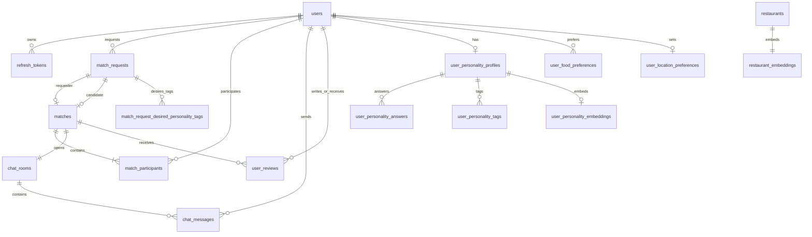

# DB 스키마 요약

> 최종 갱신: 2026-08-26
> 이 문서는 현재 JPA Entity와 컬렉션 매핑을 빠르게 확인하기 위한 요약본입니다. 정확한 설명·제약조건·DDL의 최종 기준은 [`데이터모델링.md`](./데이터모델링.md)입니다. Entity 또는 DB 구조를 변경할 때 두 문서를 함께 수정합니다.

## 공통 규칙

- 사용자 ID는 `UUID`, 일반 도메인 ID는 `BIGINT IDENTITY`를 사용합니다.
- Java Enum은 `VARCHAR` 문자열로 저장합니다.
- `Instant`는 PostgreSQL `TIMESTAMPTZ`로 저장합니다.
- 위치는 `GEOGRAPHY(POINT, 4326)`이며 Point는 경도(`x`), 위도(`y`) 순서로 생성합니다.
- 임베딩은 `VECTOR(1536)`을 사용합니다.
- `user_personality_tags`, `user_food_preferences`, `match_request_desired_personality_tags`는 독립 Entity가 아닌 `@ElementCollection` 테이블입니다.
- 정확한 현재 위치는 `users`에 저장하지 않습니다.

## 관계 한눈에 보기

## 테이블 목록

### 1. `users`

- PK: `id UUID`
- 컬럼: `email`, `password_hash`, `provider`, `provider_id`, `nickname`, `profile_image_url`, `description`, `role`, `status`, `personality_onboarding_status`, `warning_count`, `created_at`, `updated_at`
- UNIQUE: `email`, `nickname`, `(provider, provider_id)`
- Enum: `provider=LOCAL/KAKAO/GOOGLE`, `role=USER/ADMIN`, `status=ACTIVE/WITHDRAWN/BANNED`, `personality_onboarding_status=NOT_STARTED/SKIPPED/COMPLETED`
- 인증 제약: LOCAL은 비밀번호 해시만, OAuth 계정은 `provider_id`만 필수입니다.

### 2. `refresh_tokens`

- PK: `id UUID`
- FK: `user_id → users.id`, `replaced_by_token_id → refresh_tokens.id`
- 컬럼: `token_hash`, `family_id`, `expires_at`, `last_used_at`, `revoked_at`, `created_at`
- UNIQUE: `token_hash`
- 원문 토큰은 저장하지 않고 SHA-256 해시만 저장합니다.

### 3. `user_personality_profiles`

- PK/FK: `user_id → users.id ON DELETE CASCADE`
- 컬럼: `questionnaire_version`, `conversation_level`, `meal_pace`, `planning_style`, `novelty_preference`, `self_description VARCHAR(300)`, `ai_analysis_consent`, `completed_at`, `updated_at`
- 버전: `MEAL_PERSONALITY_V1`
- 점수: 각 차원 `0~100`

### 4. `user_personality_answers`

- PK: `id BIGINT`
- FK: `user_id → user_personality_profiles.user_id ON DELETE CASCADE`
- 컬럼: `question_code`, `answer_value`, `created_at`, `updated_at`
- UNIQUE: `(user_id, question_code)`
- 차원: `CONVERSATION_LEVEL`, `MEAL_PACE`, `PLANNING_STYLE`, `NOVELTY_PREFERENCE`
- 응답값: `1`, `3`, `5`

### 5. `user_personality_tags`

- 컬렉션 소유자: `UserPersonalityProfile.styleTags`
- FK: `user_id → user_personality_profiles.user_id ON DELETE CASCADE`
- 컬럼: `tag_code`
- UNIQUE: `(user_id, tag_code)`
- 최대 5개 선택은 서비스/DTO에서 검증합니다.

### 6. `user_food_preferences`

- 컬렉션 소유자: `User.foodPreferences`
- FK: `user_id → users.id ON DELETE CASCADE`
- 컬럼: `food_category`
- UNIQUE: `(user_id, food_category)`
- 최대 5개 선택은 서비스/DTO에서 검증합니다.

### 7. `user_personality_embeddings`

- PK/FK: `user_id → user_personality_profiles.user_id ON DELETE CASCADE`
- 컬럼: `source_text`, `embedding VECTOR(1536)`, `model_name`, `source_version`, `generated_at`
- 동의한 자기소개 자유 텍스트만 공통 정규화·버전 규칙(`PERSONALITY_FREE_TEXT_V2`)으로 만든 Spring AI 파생 데이터입니다. 카드 점수와 확정 태그는 포함하지 않으며, 동의 철회 시 삭제합니다. `personality-document-v1` 등 구버전 행은 새 점수 계산에서 제외하고, 유효한 프로필만 점진적으로 재생성합니다.

### 8. `user_location_preferences`

- PK/FK: `user_id → users.id`
- 컬럼: `region_code VARCHAR(5)`, `region_name`, `location_service_consent`, `updated_at`
- 사용자의 현재 좌표가 아니라 구 단위 기본 활동지역만 저장합니다.
- 기본 활동지역은 지도 초기 위치를 위한 기본값이며, `match_requests.region_code`의 요청별 선택 구와 다를 수 있습니다.

### 9. `match_requests`

- PK: `id BIGINT`
- FK: `user_id → users.id`
- 컬럼: `food_category`, `meal_at`, `region_code`, `region_name`, `location_name`, `location GEOGRAPHY`, `search_radius`, `desired_personality_text`, `desired_personality_embedding vector(1536)`, `embedding_model`, `embedding_version`, `embedded_at`, `matching_formula_version`, `status`, `reject_count`, `created_at`, `updated_at`
- `region_code`와 `location`은 해당 매칭 요청에서 사용자가 선택한 구와 핀이며, 사용자의 기본 활동지역과 일치하지 않아도 됩니다.
- 상태: `WAITING`, `CONFIRMING`, `MATCHED`, `CANCELLED`, `EXPIRED`
- 제약: `search_radius`는 NULL 또는 양수, `reject_count >= 0`; 임베딩 벡터·모델명·버전·생성 시각은 모두 존재하거나 모두 NULL

### 9-1. `match_request_desired_personality_tags`

- 컬렉션 소유자: `MatchRequest.desiredPersonalityTags`
- FK: `match_request_id → match_requests.id ON DELETE CASCADE`
- 컬럼: `tag_code` (`PersonalityTag` 문자열 Enum)
- UNIQUE: `(match_request_id, tag_code)`
- 매칭 요청 DTO에서 3개 이상 5개 이하로 검증합니다.

### 10-2. `match_proposals`

- PK: `id BIGINT`
- FK: `request_1_id → match_requests.id`, `request_2_id → match_requests.id`
- 컬럼: `request_1_decision`, `request_2_decision`, `status`, `score_snapshot JSONB`, `expires_at`, `request_1_decided_at`, `request_2_decided_at`, `created_at`, `updated_at`
- 결정: `PENDING`, `ACCEPTED`, `REJECTED`
- 상태: `PENDING`, `MATCHED`, `REJECTED`, `EXPIRED`, `CANCELLED`
- 제약: `request_1_id < request_2_id`, `(request_1_id, request_2_id)` UNIQUE, `MATCHED`이면 양쪽 모두 `ACCEPTED`, `REJECTED`이면 한쪽 이상 `REJECTED`
- `score_snapshot`은 두 방향의 점수·상위 일치 태그·사유, 최종 쌍 점수와 산식 버전을 정렬된 요청 순서로 보존합니다.
- 방향별 JSON 키는 `sourceToTargetScore`, `sourceToTargetMatchedTags`, `sourceToTargetReasons`와 `targetToSource...`이며, 외부 응답에는 현재 사용자의 방향 값만 매핑합니다.
- 수락 대기 시간: 15초

### 10. `matches`

- PK: `id BIGINT`
- FK/UNIQUE: `request_1_id → match_requests.id`, `request_2_id → match_requests.id`
- 컬럼: `status`, `matched_at`, `ended_at`, `created_at`, `updated_at`
- 상태: `MATCHED`, `COMPLETED`, `CANCELLED`
- `MATCHED` 상태에서는 `ended_at`이 NULL이고, `COMPLETED`·`CANCELLED` 상태로 종료될 때 종료 시각을 기록합니다.
- 제약: `request_1_id < request_2_id` (두 요청 간 ID 정렬 보장 및 중복 매칭 차단)
- 양쪽 수락 확정 시 요청 상태 변경, 매칭, 참여자 2명과 채팅방 생성은 하나의 DB 트랜잭션으로 처리합니다.

### 11. `match_participants`

- PK: `id BIGINT`
- FK: `match_id → matches.id`, `user_id → users.id`
- 컬럼: `role`, `joined_at`
- UNIQUE: `(match_id, user_id)`
- 역할: `PARTICIPANT` (1:1 매칭 동등 참여자)

### 12. `chat_rooms`

- PK: `id BIGINT`
- FK/UNIQUE: `match_id → matches.id`
- 컬럼: `status`, `created_at`, `closed_at`
- 상태: `ACTIVE`, `CLOSED`
- `ACTIVE` 상태에서는 `closed_at`이 NULL이고, `CLOSED` 상태로 전환할 때 종료 시각을 기록합니다. 종료된 방은 다시 활성화하지 않습니다.
- `matches` 확정 시 매칭당 하나의 채팅방을 생성합니다.

### 13. `chat_messages`

- PK: `id BIGINT`
- FK: `chat_room_id → chat_rooms.id`, `sender_id → users.id`
- 컬럼: `content TEXT`, `created_at`

### 14. `restaurants`

- PK: `id BIGINT`
- 컬럼: `name`, `category`, `address`, `location GEOGRAPHY`, `phone`, `review_count`, `created_at`, `updated_at`
- 제약: `review_count >= 0`

### 15. `restaurant_embeddings`

- PK/FK: `restaurant_id → restaurants.id`
- 컬럼: `summary`, `embedding VECTOR(1536)`, `model_name`, `source_version`, `updated_at`

### 16. `user_reviews`

- PK: `id BIGINT`
- FK: `match_id → matches.id`, `reviewer_id → users.id`, `reviewee_id → users.id`
- 컬럼: `revisit_intention NOT NULL`, `impression_tag NULL`, `visibility`, `created_at`
- UNIQUE: `(match_id, reviewer_id, reviewee_id)`
- 제약: `revisit_intention` 허용 코드 3개, `impression_tag` 허용 코드 4개 또는 NULL, `reviewer_id <> reviewee_id`, `visibility=PUBLIC/PRIVATE`
- 다시한끼 지수 집계: `visibility = PUBLIC`인 유효 후기만 포함하며 삭제·신고 승인·운영상 무효화 상태는 후속 운영 상태 도입 시 동일 조건으로 제외
- 기존 `rating`과 `content`는 사용하지 않으며, 값이 없음을 확인한 뒤 명시적 마이그레이션으로 삭제합니다.

### 17. `reports`

- PK: `id BIGINT`
- FK: `reporter_id → users.id`, `reported_user_id → users.id`, `match_id → matches.id`
- 컬럼: `category`, `reason TEXT`, `created_at`
- 제약: `category`는 `NO_SHOW`, `ABUSE`, `SPAM`, `MISINFORMATION`만 허용하는 `ReportCategory` 문자열 Enum

## Enum 코드

| Java Enum | 저장/전달 값 |
| --- | --- |
| `AuthProvider` | `LOCAL`, `KAKAO`, `GOOGLE` |
| `UserRole` | `USER`, `ADMIN` |
| `UserStatus` | `ACTIVE`, `WITHDRAWN`, `BANNED` |
| `ReportCategory` | `NO_SHOW`, `ABUSE`, `SPAM`, `MISINFORMATION` |
| `PersonalityOnboardingStatus` | `NOT_STARTED`, `SKIPPED`, `COMPLETED` |
| `FoodCategory` | `KOREAN`, `JAPANESE`, `CHINESE`, `WESTERN`, `SOUTHEAST_ASIAN`, `SNACK`, `FAST_FOOD`, `CAFE_DESSERT` |
| `PersonalityQuestionnaireVersion` | `MEAL_PERSONALITY_V1` |
| `PersonalityDimension` | `CONVERSATION_LEVEL`, `MEAL_PACE`, `PLANNING_STYLE`, `NOVELTY_PREFERENCE` |
| `PersonalityAnswerValue` | `LOW=1`, `MEDIUM=3`, `HIGH=5` |
| `PersonalityTag` | `INITIATES_CONVERSATION`, `GOOD_LISTENER`, `FOOD_TALK`, `LIGHT_CHAT`, `DEEP_TALK`, `COMFORTABLE_SILENCE`, `CALM_ATMOSPHERE`, `CHEERFUL_ATMOSPHERE`, `ACTIVE_ATMOSPHERE`, `SHARE_DISHES`, `TAKE_FOOD_PHOTOS`, `ENJOY_DESSERT`, `FOCUS_ON_MEAL` |
| `MatchRequestStatus` | `WAITING`, `CONFIRMING`, `MATCHED`, `CANCELLED`, `EXPIRED` |
| `MatchProposalStatus` | `PENDING`, `MATCHED`, `REJECTED`, `EXPIRED`, `CANCELLED` |
| `MatchProposalDecision` | `PENDING`, `ACCEPTED`, `REJECTED` |
| `MatchStatus` | `MATCHED`, `COMPLETED`, `CANCELLED` |
| `MatchParticipantRole` | `PARTICIPANT` |
| `ChatRoomStatus` | `ACTIVE`, `CLOSED` |
| `UserReviewVisibility` | `PUBLIC`, `PRIVATE` |
| `RevisitIntention` | `DEFINITELY_AGAIN`, `MAYBE_AGAIN`, `ENOUGH_FOR_NOW` |
| `ImpressionTag` | `PUNCTUAL`, `COMFORTABLE_CONVERSATION`, `CONSIDERATE`, `ACTIVE_PARTICIPATION` |

## 주요 인덱스

- 공간: `idx_match_requests_location` (`match_requests.location`), `idx_restaurants_location` (`restaurants.location`) GIST 인덱스
- 벡터: 두 embedding 컬럼의 HNSW + `vector_cosine_ops`
- 매칭: `idx_match_requests_user` (`match_requests(user_id)`), `idx_match_requests_region_status` (`match_requests(region_code, status)`)
- 채팅: `chat_messages(chat_room_id, created_at DESC)`
- 후기: `user_reviews(reviewee_id, created_at DESC, id DESC)`, 공개 집계 필터용 `user_reviews(reviewee_id, visibility, created_at DESC, id DESC)`
- 토큰: `refresh_tokens(user_id/family_id/expires_at)`
- 성향: `user_personality_answers(user_id)`, `user_personality_tags(tag_code)`, `user_food_preferences(food_category)`, `match_request_desired_personality_tags(tag_code)`

기존 DB 배포 전에는 [`docs/migrations/README.md`](../migrations/README.md)의 순서에 따라
성향, 매칭 참여자, 후기, 매칭 종료·신고 및 지역 기준 데이터 마이그레이션을 적용합니다.
마지막에는 [`현재_스키마_검증.sql`](../migrations/현재_스키마_검증.sql)로 전체 Entity 테이블과 최신 컬럼,
CHECK·UNIQUE 제약, 핵심 인덱스 및 지역 기준 데이터를 검증합니다.

## Redis 전용 데이터

- `match:user:{user_id}`: 사용자별 활성 요청 ID 또는 생성 중 예약 토큰, 기본 TTL 5분. 제안 확인 중에는 같은 요청 ID를 15초 TTL로 유지해 새 요청 생성을 막습니다. `SET NX`와 Lua 스크립트로 중복 대기를 차단합니다.
- `match:waiting:{request_id}`: 요청별 대기 소유자와 잔여 TTL, TTL 5분.
- `match:waiting:geo`: 대기 중인 요청 ID를 멤버로 갖는 Redis GEO 자료구조입니다. 좌표는 Geo 인덱스에만 전달하며 값·로그에 자유 텍스트, JWT, OAuth 식별자를 저장하지 않습니다.
- `match:waiting:geo:entry:{request_id}`: Geo 멤버의 개별 TTL 보조 키입니다.
- `match:proposal:{proposal_id}`: 제안 ID만 저장하는 15초 TTL 보조 키입니다.
- Redis 키가 먼저 만료되면 PostgreSQL `MatchRequest.status`를 보정하고, DB 기준 대기 시간이 남아 있으면 Geo·TTL 키를 재등록합니다. Redis 장애 중에는 DB 상태를 임의로 만료시키지 않고 다음 보정 주기에 재시도합니다.
