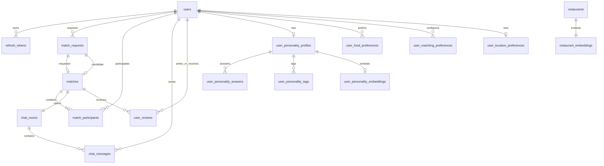

# DB 스키마 요약

> 최종 갱신: 2026-08-26
> 이 문서는 현재 JPA Entity와 컬렉션 매핑을 빠르게 확인하기 위한 요약본입니다. 정확한 설명·제약조건·DDL의 최종 기준은 [`데이터모델링.md`](./데이터모델링.md)입니다. Entity 또는 DB 구조를 변경할 때 두 문서를 함께 수정합니다.

## 공통 규칙

- 사용자 ID는 `UUID`, 일반 도메인 ID는 `BIGINT IDENTITY`를 사용합니다.
- Java Enum은 `VARCHAR` 문자열로 저장합니다.
- `Instant`는 PostgreSQL `TIMESTAMPTZ`로 저장합니다.
- 위치는 `GEOGRAPHY(POINT, 4326)`이며 Point는 경도(`x`), 위도(`y`) 순서로 생성합니다.
- 임베딩은 `VECTOR(1536)`을 사용합니다.
- `user_personality_tags`, `user_food_preferences`는 독립 Entity가 아닌 `@ElementCollection` 테이블입니다.
- 정확한 현재 위치는 `users`에 저장하지 않습니다.

## 관계 한눈에 보기

## 테이블 목록

### 1. `users`

- PK: `id UUID`
- 컬럼: `email`, `password_hash`, `provider`, `provider_id`, `nickname`, `profile_image_url`, `description`, `role`, `status`, `personality_onboarding_status`, `created_at`, `updated_at`
- UNIQUE: `email`, `nickname`, `(provider, provider_id)`
- Enum: `provider=LOCAL/KAKAO/GOOGLE`, `role=USER/ADMIN`, `status=ACTIVE/WITHDRAWN`, `personality_onboarding_status=NOT_STARTED/SKIPPED/COMPLETED`
- 인증 제약: LOCAL은 비밀번호 해시만, OAuth 계정은 `provider_id`만 필수입니다.

### 2. `refresh_tokens`

- PK: `id UUID`
- FK: `user_id → users.id`, `replaced_by_token_id → refresh_tokens.id`
- 컬럼: `token_hash`, `family_id`, `expires_at`, `last_used_at`, `revoked_at`, `created_at`
- UNIQUE: `token_hash`
- 원문 토큰은 저장하지 않고 SHA-256 해시만 저장합니다.

### 3. `user_personality_profiles`

- PK/FK: `user_id → users.id ON DELETE CASCADE`
- 컬럼: `questionnaire_version`, `conversation_level`, `meal_pace`, `planning_style`, `novelty_preference`, `self_description VARCHAR(300)`, `ai_analysis_consent`, `completed_at`, `updated_at`
- 버전: `MEAL_PERSONALITY_V1`
- 점수: 각 차원 `0~100`

### 4. `user_personality_answers`

- PK: `id BIGINT`
- FK: `user_id → user_personality_profiles.user_id ON DELETE CASCADE`
- 컬럼: `question_code`, `answer_value`, `created_at`, `updated_at`
- UNIQUE: `(user_id, question_code)`
- 차원: `CONVERSATION_LEVEL`, `MEAL_PACE`, `PLANNING_STYLE`, `NOVELTY_PREFERENCE`
- 응답값: `1`, `3`, `5`

### 5. `user_personality_tags`

- 컬렉션 소유자: `UserPersonalityProfile.styleTags`
- FK: `user_id → user_personality_profiles.user_id ON DELETE CASCADE`
- 컬럼: `tag_code`
- UNIQUE: `(user_id, tag_code)`
- 최대 5개 선택은 서비스/DTO에서 검증합니다.

### 6. `user_food_preferences`

- 컬렉션 소유자: `User.foodPreferences`
- FK: `user_id → users.id ON DELETE CASCADE`
- 컬럼: `food_category`
- UNIQUE: `(user_id, food_category)`
- 최대 5개 선택은 서비스/DTO에서 검증합니다.

### 7. `user_personality_embeddings`

- PK/FK: `user_id → user_personality_profiles.user_id ON DELETE CASCADE`
- 컬럼: `source_text`, `embedding VECTOR(1536)`, `model_name`, `source_version`, `generated_at`
- 동의한 자기소개와 정형 프로필로 만든 버전 문서의 Spring AI 파생 데이터입니다. 동의 철회 시 삭제합니다.

### 8. `user_matching_preferences`

- 복합 PK: `(user_id, dimension)`
- FK: `user_id → users.id ON DELETE CASCADE`
- 컬럼: `importance`, `preference_mode`, `updated_at`
- 차원: 네 가지 `PersonalityDimension`
- 제약: `importance=0~5`, `preference_mode=SIMILAR/COMPLEMENTARY`

### 9. `user_location_preferences`

- PK/FK: `user_id → users.id`
- 컬럼: `region_code VARCHAR(5)`, `region_name`, `location_service_consent`, `updated_at`
- 사용자의 현재 좌표가 아니라 구 단위 기본 활동지역만 저장합니다.

### 10. `match_requests`

- PK: `id BIGINT`
- FK: `user_id → users.id`
- 컬럼: `food_category`, `meal_at`, `region_code`, `region_name`, `location_name`, `location GEOGRAPHY`, `search_radius`, `desired_personality_text`, `preference_snapshot JSONB`, `matching_formula_version`, `status`, `reject_count`, `created_at`, `updated_at`
- 상태: `WAITING`, `CONFIRMING`, `MATCHED`, `CANCELLED`, `EXPIRED`
- 제약: `search_radius`는 NULL 또는 양수, `reject_count >= 0`

### 11. `matches`

- PK: `id BIGINT`
- FK/UNIQUE: `requester_request_id → match_requests.id`, `candidate_request_id → match_requests.id`
- 컬럼: `status`, `matched_at`, `created_at`, `updated_at`
- 상태: `MATCHED`, `COMPLETED`, `CANCELLED`
- 제약: requester와 candidate 요청은 서로 달라야 합니다.

### 12. `match_participants`

- PK: `id BIGINT`
- FK: `match_id → matches.id`, `user_id → users.id`
- 컬럼: `role`, `joined_at`
- UNIQUE: `(match_id, user_id)`
- 역할: `REQUESTER`, `CANDIDATE`

### 13. `chat_rooms`

- PK: `id BIGINT`
- FK/UNIQUE: `match_id → matches.id`
- 컬럼: `status`, `created_at`, `closed_at`
- 상태: `ACTIVE`, `CLOSED`

### 14. `chat_messages`

- PK: `id BIGINT`
- FK: `chat_room_id → chat_rooms.id`, `sender_id → users.id`
- 컬럼: `content TEXT`, `created_at`

### 15. `restaurants`

- PK: `id BIGINT`
- 컬럼: `name`, `category`, `address`, `location GEOGRAPHY`, `phone`, `review_count`, `created_at`, `updated_at`
- 제약: `review_count >= 0`

### 16. `restaurant_embeddings`

- PK/FK: `restaurant_id → restaurants.id`
- 컬럼: `summary`, `embedding VECTOR(1536)`, `model_name`, `source_version`, `updated_at`

### 17. `user_reviews`

- PK: `id BIGINT`
- FK: `match_id → matches.id`, `reviewer_id → users.id`, `reviewee_id → users.id`
- 컬럼: `rating`, `content`, `visibility`, `created_at`
- UNIQUE: `(match_id, reviewer_id, reviewee_id)`
- 제약: `rating=1~5`, `reviewer_id <> reviewee_id`, `visibility=PUBLIC/PRIVATE`

## Enum 코드

| Java Enum | 저장/전달 값 |
| --- | --- |
| `AuthProvider` | `LOCAL`, `KAKAO`, `GOOGLE` |
| `UserRole` | `USER`, `ADMIN` |
| `UserStatus` | `ACTIVE`, `WITHDRAWN` |
| `PersonalityOnboardingStatus` | `NOT_STARTED`, `SKIPPED`, `COMPLETED` |
| `FoodCategory` | `KOREAN`, `JAPANESE`, `CHINESE`, `WESTERN`, `SOUTHEAST_ASIAN`, `SNACK`, `FAST_FOOD`, `CAFE_DESSERT` |
| `PersonalityQuestionnaireVersion` | `MEAL_PERSONALITY_V1` |
| `PersonalityDimension` | `CONVERSATION_LEVEL`, `MEAL_PACE`, `PLANNING_STYLE`, `NOVELTY_PREFERENCE` |
| `PersonalityAnswerValue` | `LOW=1`, `MEDIUM=3`, `HIGH=5` |
| `PersonalityTag` | `INITIATES_CONVERSATION`, `GOOD_LISTENER`, `FOOD_TALK`, `LIGHT_CHAT`, `DEEP_TALK`, `COMFORTABLE_SILENCE`, `CALM_ATMOSPHERE`, `CHEERFUL_ATMOSPHERE`, `ACTIVE_ATMOSPHERE`, `SHARE_DISHES`, `TAKE_FOOD_PHOTOS`, `ENJOY_DESSERT`, `FOCUS_ON_MEAL` |
| `PreferenceMode` | `SIMILAR`, `COMPLEMENTARY` |
| `MatchRequestStatus` | `WAITING`, `CONFIRMING`, `MATCHED`, `CANCELLED`, `EXPIRED` |
| `MatchStatus` | `MATCHED`, `COMPLETED`, `CANCELLED` |
| `MatchParticipantRole` | `REQUESTER`, `CANDIDATE` |
| `ChatRoomStatus` | `ACTIVE`, `CLOSED` |
| `UserReviewVisibility` | `PUBLIC`, `PRIVATE` |

## 주요 인덱스

- 공간: `match_requests.location`, `restaurants.location`의 GIST 인덱스
- 벡터: 두 embedding 컬럼의 HNSW + `vector_cosine_ops`
- 매칭: `match_requests(user_id)`, `match_requests(region_code, status)`
- 채팅: `chat_messages(chat_room_id, created_at DESC)`
- 토큰: `refresh_tokens(user_id/family_id/expires_at)`
- 성향: `user_personality_answers(user_id)`, `user_personality_tags(tag_code)`, `user_food_preferences(food_category)`

## Redis 전용 데이터

- `waiting:{user_id}`: 사용자별 매칭 대기 상태, TTL 10분
- `active_matching_users`: 매칭 대기 사용자 위치를 위한 Redis GEO 자료구조
- Redis의 임시 대기 상태와 TTL 만료 시각은 PostgreSQL에 중복 저장하지 않습니다.
