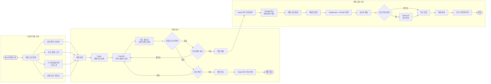

# 문제 정의

>
>
>
> 1인 가구와 사회적 고립의 증가로 인해 함께 식사하며 자연스럽게 사람을 만날 기회가 감소하고 있으며, 기존의 소개팅·커뮤니티 서비스는 부담이 커 가볍게 식사를 매개로 교류할 수 있는 연결 수단을 위한 지역·시간·식사 목적 기반의 실시간 1:1 매칭 플랫폼
>

---

# 1.1 목적

본 문서는 혼밥을 원하지 않는 20~30대 사용자를 대상으로 하는 웹 기반 식사 매칭 서비스의 기능 및 비기능 요구사항을 정의하는 것을 목적으로 한다.

# 1.2 서비스 목적

사용자의 희망 매칭 장소, 식사 시간, 음식 취향과 성향 등의 조건을 기반으로 함께 식사할 한 명의 사용자를 실시간 매칭하고, 매칭 이후 채팅 및 후기 기능을 통해 자연스럽고 부담 없는 교류 환경을 제공한다.

# 1.3 주요 사용자

- 혼자 식사하는 것을 부담스러워 하는 20 ~ 30대
- 새로운 친구를 만들고 싶은 사용자
- 같은 취미나 관심사를 가진 사람과 식사하고 싶은 사용자

---

# 2. 사용자 유형

- 비회원 : 서비스 소개 및 일부 공개 게시글 조회 가능
- 일반 회원 : 매칭, 게시글 작성, 채팅, 후기 작성 등 주요 기능 사용 가능
- 관리자  : 사용자 및 게시글 관리 —> 추후 논의

---

# 3. 기능 요구사항

## FR-01. 회원 관리

| ID | 요구사항 | 우선순위 |
| --- | --- | --- |
| FR-01-01 | 사용자는 회원가입을 할 수 있어야 한다. | 필수 |
| FR-01-02 | 사용자는 로그인 및 로그아웃을 할 수 있어야 한다. | 필수 |
| FR-01-03 | 사용자는 회원탈퇴를 할 수 있어야 한다. | 필수 |
| FR-01-04 | 사용자는 자신의 프로필 정보를 조회할 수 있어야 한다. | 필수 |
| FR-01-05 | 사용자는 닉네임, 프로필 이미지, 관심사 등의 정보를 수정할 수 있어야 한다. | 필수 |
| FR-01-06 | 인증되지 않은 사용자는 매칭, 채팅 등 회원 전용 기능을 사용할 수 없어야 한다. | 필수 |
| FR-01-07 | 시스템은 사용자별 권한을 구분하여 접근을 제어해야 한다. | 필수 |
| FR-01-08 | 시스템은 OAuth 가입 시 이메일 미제공·미검증, Provider 충돌 및 닉네임 중복을 정해진 정책에 따라 처리해야 한다. | 필수 |
| FR-01-09 | 사용자는 가입 완료 후 선택형 온보딩에서 자가 응답 기반 식사·대화 성향을 설정할 수 있어야 한다. | 선택 |
| FR-01-10 | 사용자는 자신의 성향 프로필을 조회·수정·초기화할 수 있어야 한다. 상대방 선호는 성향 조사에 포함하지 않는다. | 필수 |

---

# 4. 실시간 1:1 매칭

## FR-03. 실시간 매칭

| ID | 요구사항 | 우선순위 |
| --- | --- | --- |
| FR-03-01 | 회원은 실시간 매칭을 요청할 수 있어야 한다. | 필수 |
| FR-03-02 | 사용자는 구 단위 기본 활동지역을 설정하고, 마주한끼 진입 시 해당 지역을 초기 위치로 사용하며, 기본 활동지역과 다른 구도 선택해 지도 핀으로 매칭 기준 위치를 설정할 수 있어야 한다. | 필수 |
| FR-03-03 | 사용자는 원하는 식사 시간대를 설정할 수 있어야 한다. | 필수 |
| FR-03-05 | 시스템은 매칭 대기 중인 사용자의 상태를 관리해야 한다. | 필수 |
| FR-03-06 | 시스템은 위치, 시간, 성향 등의 조건을 기반으로 적합한 1명의 사용자를 탐색해야 한다. | 필수 |
| FR-03-07 | 매칭이 성사되면 참여 사용자에게 매칭 결과를 실시간으로 전달해야 한다. | 필수 |
| FR-03-08 | 사용자는 매칭 대기 중 요청을 취소할 수 있어야 한다. | 필수 |
| FR-03-09 | 일정 시간이 지나도 매칭되지 않은 요청은 자동 만료될 수 있어야 한다. | 선택 |
| FR-03-10 | 동일 사용자가 동시에 여러 매칭에 중복 참여하지 못하도록 제한할 수 있어야 한다. | 필수 |
| FR-03-11 | 사용자는 매칭 시작 전에 원하는 상대의 태그·자유 텍스트를 입력할 수 있고, 시스템은 하드 필터를 통과한 후보에 한해 상대방이 가입 후 작성한 본인 성향과 비교하여 설명 가능한 호환도 점수로 정렬해야 한다. | 선택 |
| FR-03-12 | AI 또는 임베딩 기능에 장애가 발생하거나 성향 프로필이 없는 경우에도 기본 조건 매칭은 정상 동작해야 한다. | 필수 |
| FR-03-13 | 후보 제안이 생성되면 양쪽 사용자에게 프로필 확인과 동일한 응답 제한 시간을 실시간으로 전달해야 한다. | 필수 |

---

# 5. 위치 기반 매칭

## FR-04. 위치 기능

| ID | 요구사항 | 우선순위 |
| --- | --- | --- |
| FR-04-01 | 시스템은 사용자가 선택한 구 단위 활동지역과 지도 핀의 위도·경도를 구분하여 처리할 수 있어야 한다. | 필수 |
| FR-04-03 | 시스템은 특정 반경 내에 있는 매칭 후보를 조회할 수 있어야 한다. | 필수 |
| FR-04-04 | 사용자는 기본 3km로 매칭 검색을 시작하고, 후보가 없을 때 확인 후 5km로 확장할 수 있어야 한다. | 선택 |
| FR-04-05 | 시스템은 사용자들이 선택한 희망 매칭 장소 핀 간 거리를 계산할 수 있어야 한다. | 필수 |
| FR-04-06 | 위치 정보는 사용자의 동의를 받은 경우에만 수집되어야 한다. | 필수 |
| FR-04-07 | 시스템은 Geolocation API 없이 구 단위 활동지역의 대표 좌표로 지도를 초기화하고 사용자가 핀으로 세부 위치를 확정할 수 있어야 한다. | 필수 |
| FR-04-08 | 시스템은 선택한 핀이 선택한 구에 속하는지 검증하고, 거리 표현이 실제 사용자 위치가 아닌 선택 핀 기준임을 표시해야 한다. | 필수 |

---

# 6. 실시간 채팅

## FR-05. 채팅

| ID | 요구사항 | 우선순위 |
| --- | --- | --- |
| FR-05-01 | 매칭이 완료된 사용자들 사이에 채팅방이 생성되어야 한다. | 필수 |
| FR-05-02 | 사용자는 채팅방에서 실시간 메시지를 전송하고 수신할 수 있어야 한다. | 필수 |
| FR-05-03 | 사용자는 자신이 참여한 채팅방 목록을 조회할 수 있어야 한다. | 필수 |
| FR-05-04 | 사용자는 채팅방의 이전 메시지를 조회할 수 있어야 한다. | 필수 |
| FR-05-05 | 허가되지 않은 사용자는 해당 채팅방에 접근할 수 없어야 한다. | 필수 |
| FR-05-06 | 매칭 종료 이후 채팅방을 종료 상태로 전환할 수 있어야 한다. | 선택 |
| FR-05-07 | 사용자는 지도에서 선택한 식당을 구조화된 카드 메시지로 채팅에 공유하고 다시 지도에서 확인할 수 있어야 한다. | 필수 |

---

# 7. 방명록 및 매칭 후기

## FR-07. 사용자 후기

| ID | 요구사항 | 우선순위 |
| --- | --- | --- |
| FR-07-01 | 매칭에 실제 참여한 사용자만 상대방에게 후기를 작성할 수 있어야 한다. | 필수 |
| FR-07-02 | 사용자는 다른 사용자의 공개된 매칭 후기를 조회할 수 있어야 한다. | 필수 |
| FR-07-03 | 후기에는 상대방에 대한 재만남 의향을 필수로 선택하고 인상 태그를 최대 1개 선택할 수 있어야 한다. | 필수 |
| FR-07-04 | 사용자는 부적절한 후기를 신고할 수 있어야 한다. | 선택 |
| FR-07-05 | 사용자가 원할 경우 일부 후기를 비공개 처리할 수 있도록 정책을 설정할 수 있어야 한다. | 선택 |

MVP 후기 작성은 `POST /reviews`에서 인증 사용자와 `matchId`의 실제 참여 관계를 서버가 확인한 뒤 처리한다. 매칭이 `COMPLETED` 상태이고 `matches.ended_at`부터 7일 이내일 때만 작성할 수 있으며, 요청에는 필수 재만남 의향 하나와 선택 인상 태그 하나만 포함한다. 별점·자유 서술형 내용은 받지 않는다. 마이페이지와 공개 프로필에는 개별 후기 대신 공개 후기 집계와 다시한끼 지수 상태·점수·유효 후기 수를 제공한다.

---

# 8. AI 식당 추천

## FR-08. AI 추천

| ID | 요구사항 | 우선순위 |
| --- | --- | --- |
| FR-08-01 | 사용자는 매칭 조건을 기반으로 식당 추천을 요청할 수 있어야 한다. | 선택 |
| FR-08-02 | 시스템은 두 사용자의 희망 지역, 음식 종류, 예산 등의 정보를 활용하여 적절한 식당을 추천할 수 있어야 한다. | 선택 |
| FR-08-03 | AI 추천 기능에 장애가 발생하더라도 기본 매칭 기능은 정상적으로 사용할 수 있어야 한다. | 필수 |
| FR-08-04 | AI가 생성한 추천 결과임을 사용자에게 구분하여 표시해야 한다. | 선택 |

---

# 9. 마이페이지

## FR-09. 마이페이지

| ID | 요구사항 | 우선순위 |
| --- | --- | --- |
| FR-09-01 | 사용자는 자신의 프로필을 조회할 수 있어야 한다. | 필수 |
| FR-09-03 | 사용자는 마이페이지에서 최근 매칭 기록을 최신순으로 최대 5개 확인할 수 있어야 한다. | 필수 |
| FR-09-05 | 사용자는 자신이 받은 방명록 및 매칭 후기를 조회할 수 있어야 한다. | 필수 |
| FR-09-06 | 사용자는 자신의 회원 정보를 수정할 수 있어야 한다. | 필수 |

---

# 10. MVP 우선순위

초기 개발에서는 모든 기능을 동시에 구현하기보다 다음 순서로 진행한다.

### 1순위

- 회원가입 / 로그인 / 로그아웃
- 사용자 프로필
- 구 단위 기본 활동지역과 지도 핀 기반 희망 매칭 장소 저장
- 실시간 매칭 요청
- Redis 기반 매칭 대기 상태
- PostGIS 기반 주변 사용자 검색
- 매칭 성사 및 결과 저장

### 2순위

- 매칭된 사용자 간 채팅
- 마이페이지
- 매칭 내역
- 선택형 성향 온보딩 및 결정론적 성향 호환도 랭킹

### 3순위

- 매칭 후기 및 방명록
- AI 기반 식당 추천

### 4순위

- 관리자 기능
- 신고/제재
- 모니터링 및 성능 최적화

---

