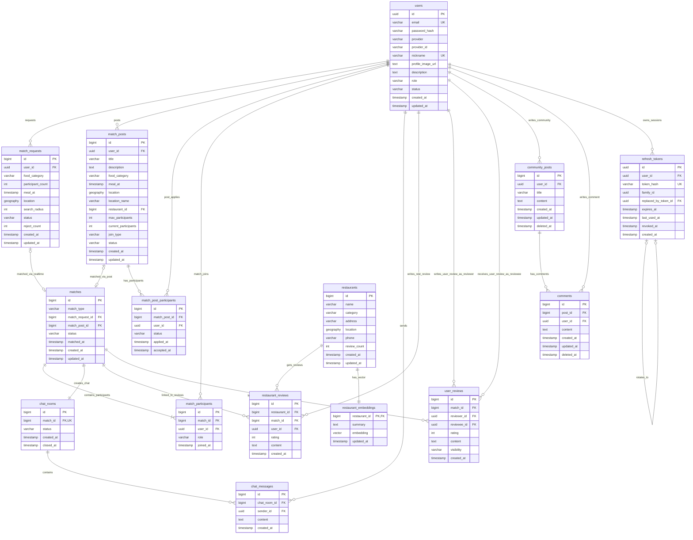

# 데이터베이스 모델링 및 설계 정의서 (PostgreSQL + PostGIS + pgvector + Redis)

본 문서는 실시간 매칭 및 게시판 매칭 기능을 포함한 맛집 매칭 서비스의 데이터베이스 설계를 정의합니다. 
영구 저장소로는 **PostgreSQL**과 공간 연산 확장 모듈인 **PostGIS**, AI 기반 식당 추천을 위한 **pgvector**를 사용하며, 실시간 매칭 상태 관리 및 만료 처리 등 휘발성 상태 관리를 위해 **Redis**를 함께 활용합니다.

---

## 1. 설계 개요

1. **영구 데이터베이스**: PostgreSQL (Supabase)
   - 사용자 계정과 Refresh Token 세션, 매칭 게시글/참여자 정보, 최종 성사된 매칭 정보, 채팅방/메시지, 식당 및 리뷰, 커뮤니티 데이터 등 장기 보존이 필요한 데이터를 관리합니다.
2. **위치 데이터 처리 (PostGIS)**:
   - 사용자의 실시간 현재 위치는 개인정보 보호 및 데이터 정밀성 유지를 위해 `USER` 테이블에 저장하지 않습니다.
   - 위치가 필요한 시점(실시간 매칭 요청 시 `MATCH_REQUEST.location`, 게시판 매칭 장소 `MATCH_POST.location`, 식당 위치 `RESTAURANT.location`)에만 `GEOGRAPHY(POINT, 4326)` 타입으로 저장합니다.
   - GIST 공간 인덱스를 활용하여 반경 검색(`ST_DWithin`) 및 거리 계산을 효율적으로 수행합니다.
3. **AI 추천 (pgvector)**:
   - 식당 리뷰 텍스트를 임베딩 벡터로 변환하여 `RESTAURANT_EMBEDDING` 테이블에 저장합니다.
   - Cosine Similarity(`vector_cosine_ops`) 기반의 HNSW 인덱스를 설정하여 유사 식당 추천 연산을 최적화합니다.
4. **실시간/휘발성 데이터 관리 (Redis)**:
   - 실시간 매칭 대기열, 매칭 매칭 대기 후보군 탐색, 실시간 이벤트 알림(Pub/Sub), 매칭 요청의 TTL(만료 시간)은 **Redis**에서 전담하여 처리합니다.
   - PostgreSQL에는 임시 상태(예: 매칭 대기 중인 사용자의 세부 정보, 요청 만료 시각 `expires_at` 등)를 불필요하게 중복 저장하지 않고, 최종 결과물 및 변경 이력만 동기화하여 저장합니다.

---

## 2. 개념적 설계 (Conceptual Design)

### 2.1 핵심 개체(Entity) 목록

| 번호 | 개체명 | 물리 테이블명 | 설명 |
| :--- | :--- | :--- | :--- |
| 1 | 사용자 | `users` | 서비스 이용자 정보 |
| 2 | 실시간 매칭 요청 | `match_requests` | 실시간 1:1 매칭 요청 정보 및 진행 이력 |
| 3 | 모집 게시글 | `match_posts` | 함께 식사할 사람을 모집하는 게시판 글 (1:1 또는 1:N) |
| 4 | 모집글 신청자 | `match_post_participants` | 게시글 참여 신청 및 수락/승인 상태 관리 |
| 5 | 최종 매칭 | `matches` | 실시간 및 게시글 매칭의 최종 매칭 결과 정보 |
| 6 | 매칭 실제 참여자 | `match_participants` | 최종 성사된 매칭에 실제 참여하는 사용자 정보 |
| 7 | 채팅방 | `chat_rooms` | 매칭 성공 시 생성되는 1:1 대응 채팅방 |
| 8 | 채팅 메시지 | `chat_messages` | 채팅방 내부에서 송수신된 메시지 내역 |
| 9 | 식당 | `restaurants` | 매칭 및 추천의 대상이 되는 식당 기본 정보 |
| 10 | 식당 리뷰 | `restaurant_reviews` | 식사 후 방문한 식당에 대해 작성한 평점 및 후기 |
| 11 | 식당 임베딩 | `restaurant_embeddings` | AI 식당 추천에 활용되는 식당 리뷰 임베딩 벡터 |
| 12 | 매너 후기 | `user_reviews` | 매칭 상대방에 대해 작성한 매너 및 평점 후기 |
| 13 | 커뮤니티 게시글 | `community_posts` | 커뮤니티 내 자유게시판 글 |
| 14 | 댓글 | `comments` | 커뮤니티 게시글에 달린 댓글 |
| 15 | Refresh Token | `refresh_tokens` | 로그인 세션별 Refresh Token 해시, 만료·회전·폐기 이력 |

### 2.2 관계 요약 (Relationship)

- **USER**: 
  - `users` (1) : (N) `match_requests`
  - `users` (1) : (N) `match_posts`
  - `users` (1) : (N) `match_post_participants`
  - `users` (1) : (N) `match_participants`
  - `users` (1) : (N) `chat_messages`
  - `users` (1) : (N) `restaurant_reviews`
  - `users` (1) : (N) `user_reviews` (작성자 `reviewer` / 대상자 `reviewee`)
  - `users` (1) : (N) `community_posts`
  - `users` (1) : (N) `comments`
  - `users` (1) : (N) `refresh_tokens`
- **MATCH_REQUEST & MATCH_POST**:
  - `match_requests` (1) : (0..1) `matches` (실시간 매칭 결과)
  - `match_posts` (1) : (0..1) `matches` (게시판 매칭 결과)
  - `match_posts` (1) : (N) `match_post_participants`
- **MATCH**:
  - `matches` (1) : (N) `match_participants`
  - `matches` (1) : (1) `chat_rooms` (1:1 대응 관계)
  - `matches` (1) : (N) `restaurant_reviews`
  - `matches` (1) : (N) `user_reviews`
- **CHAT**:
  - `chat_rooms` (1) : (N) `chat_messages`
- **RESTAURANT**:
  - `restaurants` (1) : (N) `restaurant_reviews`
  - `restaurants` (1) : (1) `restaurant_embeddings` (1:1 대응 관계)
- **COMMUNITY**:
  - `community_posts` (1) : (N) `comments`

---

### 2.3 ERD (Entity Relationship Diagram)



---

## 3. 논리적 설계 (Logical Design)

### 3.1 위치 데이터 저장 원칙
- **사용자 위치 미저장**: `users` 테이블에는 사용자의 실시간 현재 위치를 보관하지 않습니다.
- **필요 시점의 저장**:
  - 실시간 매칭 요청 시점의 현재 위치: `match_requests.location`
  - 모집 게시글상의 모임 약속 위치: `match_posts.location`
  - 음식점 주소 위치: `restaurants.location`
- **조회/반경 검색**: PostGIS 함수(`ST_DWithin`, `ST_Distance` 등)를 사용하여 쿼리 시점에 계산합니다.

### 3.2 Redis와 DB(PostgreSQL)의 역할 분담
- **Redis 관리 대상**:
  - 실시간 매칭 요청의 생명 주기 관리 및 매칭 매치메이킹 큐
  - 10분 대기 시간(TTL) 및 사용자별 매칭 진행 대기 상태(`waiting:{user_id}`)
  - 실시간 이벤트 알림 처리를 위한 Pub/Sub 메시지 채널
- **PostgreSQL 저장 대상**:
  - Redis의 대기 상태를 제외한, 최종 매칭 성공/실패 이력 로그 (`match_requests` 테이블에 저장되어 감사/통계용으로 활용)
  - `expires_at`과 같은 일시적인 세션 성격의 정보는 DB에 중복 저장하지 않습니다.

---

### 3.3 테이블별 논리 명세

#### 1. `users` (사용자)
- 회원 기본 정보 및 상태를 관리합니다.

| 컬럼명 | 논리 타입 | 제약 조건 | 설명 |
| :--- | :--- | :--- | :--- |
| `id` | UUID | PK, DEFAULT `gen_random_uuid()` | 사용자 식별 고유키 |
| `email` | VARCHAR(255) | UNIQUE, NOT NULL | 이메일 주소 (인증용 식별자) |
| `password_hash` | VARCHAR(255) | NULL | Argon2로 해싱한 비밀번호. 카카오·Google OAuth2 전용 계정은 NULL이며 원문 비밀번호는 저장하지 않음 |
| `provider` | VARCHAR(20) | NOT NULL, DEFAULT `LOCAL` | 가입 방식 (`LOCAL`, `KAKAO`, `GOOGLE`) |
| `provider_id` | VARCHAR(255) | NULL | OAuth 제공자가 발급한 고유 사용자 ID. LOCAL 계정은 NULL |
| `nickname` | VARCHAR(100) | UNIQUE, NOT NULL | 사용자 닉네임 |
| `profile_image_url` | TEXT | NULL | 프로필 이미지 URL |
| `description` | TEXT | NULL | 자기소개 및 한 줄 평 |
| `role` | VARCHAR(20) | NOT NULL | 회원 권한 (`USER`, `ADMIN`) |
| `status` | VARCHAR(20) | NOT NULL | 회원 활동 상태 (`ACTIVE`, `WITHDRAWN`) |
| `created_at` | TIMESTAMP | NOT NULL | 가입 일시 |
| `updated_at` | TIMESTAMP | NOT NULL | 정보 수정 일시 |

- *Unique Constraint*: `(provider, provider_id)` (OAuth 제공자별 사용자 고유 ID 중복 방지)
- *Check Constraint*: LOCAL 계정은 `password_hash`가 필수이고 `provider_id`는 NULL이어야 하며, KAKAO·GOOGLE 계정은 `password_hash`가 NULL이고 `provider_id`가 필수입니다.
- 동일 이메일이 다른 Provider로 이미 가입되어 있으면 자동으로 계정을 연결하지 않고 기존 가입 방식을 안내합니다.

#### 2. `match_requests` (실시간 매칭 요청)
- 실시간 1:1 매칭 요청 기록을 저장합니다. 대기 상태 자체와 TTL 관리는 Redis가 수행합니다.

| 컬럼명 | 논리 타입 | 제약 조건 | 설명 |
| :--- | :--- | :--- | :--- |
| `id` | BIGINT | PK | 실시간 매칭 요청 고유 식별 번호 |
| `user_id` | UUID | FK -> `users.id`, NOT NULL | 매칭을 요청한 사용자 |
| `food_category` | VARCHAR(100) | NOT NULL | 희망 식음료 카테고리 |
| `participant_count` | INT | NOT NULL | 희망 인원 (실시간 1:1은 항상 본인 포함 2명) |
| `meal_at` | TIMESTAMP | NOT NULL | 희망 식사 일시 |
| `location` | GEOGRAPHY(POINT, 4326) | NOT NULL | 요청을 시작한 사용자 현재 위치 (PostGIS) |
| `search_radius` | INT | NULL | 탐색 반경 (단위: 미터) |
| `status` | VARCHAR(20) | NOT NULL | 요청 상태 (`WAITING`, `CONFIRMING`, `MATCHED`, `CANCELLED`, `EXPIRED`) |
| `reject_count` | INT | NOT NULL, DEFAULT 0 | 거절 횟수 기록 (매칭 성사 실패 분석용) |
| `created_at` | TIMESTAMP | NOT NULL | 요청 일시 |
| `updated_at` | TIMESTAMP | NOT NULL | 상태 변경 일시 |

#### 3. `match_posts` (매칭 모집글)
- 모집 게시판을 통한 식사 매칭(1:1 또는 1:N)의 세부 정보를 관리합니다.

| 컬럼명 | 논리 타입 | 제약 조건 | 설명 |
| :--- | :--- | :--- | :--- |
| `id` | BIGINT | PK | 모집글 고유 식별 번호 |
| `user_id` | UUID | FK -> `users.id`, NOT NULL | 모집글을 올린 사용자 (방장/Host) |
| `title` | VARCHAR(255) | NOT NULL | 모집글 제목 |
| `description` | TEXT | NOT NULL | 모집글 설명 및 규칙 |
| `food_category` | VARCHAR(100) | NOT NULL | 음식 카테고리 |
| `meal_at` | TIMESTAMP | NOT NULL | 약속 식사 시간 |
| `location` | GEOGRAPHY(POINT, 4326) | NOT NULL | 약속 모임 장소 좌표 |
| `location_name` | VARCHAR(255) | NULL | 약속 장소 지명 / 상호명 |
| `restaurant_id` | BIGINT | FK -> `restaurants.id`, NULL | 지정 식당 정보 (선택 사항) |
| `max_participants` | INT | NOT NULL | 최대 모집 정원 |
| `current_participants` | INT | NOT NULL, DEFAULT 1 | 현재 확정된 참여 인원 (최소 1명 - 작성자 본인) |
| `join_type` | VARCHAR(20) | NOT NULL | 참여 방식 (`APPROVAL`: 수락제, `INSTANT`: 선착순 즉시 참여) |
| `status` | VARCHAR(20) | NOT NULL | 모집 상태 (`RECRUITING`, `CLOSED`, `COMPLETED`) |
| `created_at` | TIMESTAMP | NOT NULL | 작성 시간 |
| `updated_at` | TIMESTAMP | NOT NULL | 수정 시간 |

#### 4. `match_post_participants` (모집글 참여 신청자)
- 게시판 모집글에 대한 참여 신청 및 허가 상태를 관리합니다.

| 컬럼명 | 논리 타입 | 제약 조건 | 설명 |
| :--- | :--- | :--- | :--- |
| `id` | BIGINT | PK | 신청 고유 번호 |
| `match_post_id` | BIGINT | FK -> `match_posts.id`, NOT NULL | 신청 대상 모집글 |
| `user_id` | UUID | FK -> `users.id`, NOT NULL | 참여 신청을 보낸 사용자 |
| `status` | VARCHAR(20) | NOT NULL | 신청 처리 상태 (`PENDING`, `ACCEPTED`, `REJECTED`, `CANCELLED`) |
| `applied_at` | TIMESTAMP | NOT NULL | 신청 일시 |
| `accepted_at` | TIMESTAMP | NULL | 승인/수락 일시 |

- *Unique Constraint*: `(match_post_id, user_id)` (동일 글에 대한 중복 신청 방지)

#### 5. `matches` (최종 매칭 결과)
- 실시간 매칭 또는 게시글 모집을 거쳐 최종 성사된 식사 매칭 레코드입니다.

| 컬럼명 | 논리 타입 | 제약 조건 | 설명 |
| :--- | :--- | :--- | :--- |
| `id` | BIGINT | PK | 최종 매칭 식별 고유키 |
| `match_type` | VARCHAR(20) | NOT NULL | 매칭 유형 구분 (`REALTIME`: 실시간, `POST`: 게시글 기반) |
| `match_request_id` | BIGINT | FK -> `match_requests.id`, NULL | 실시간 매칭일 때 연결 |
| `match_post_id` | BIGINT | FK -> `match_posts.id`, NULL | 게시글 매칭일 때 연결 |
| `status` | VARCHAR(20) | NOT NULL | 최종 매칭 상태 (`MATCHED`, `COMPLETED`, `CANCELLED`) |
| `matched_at` | TIMESTAMP | NOT NULL | 매칭 성사 완료 일시 |
| `created_at` | TIMESTAMP | NOT NULL | 데이터 생성 시간 |
| `updated_at` | TIMESTAMP | NOT NULL | 최종 수정 시간 |

- *Check Constraint*: `REALTIME`일 때 `match_request_id` 필수 및 `match_post_id` NULL, `POST`일 때 `match_post_id` 필수 및 `match_request_id` NULL.

#### 6. `match_participants` (매칭 실제 참여자)
- 최종 성사된 매칭에 합류하게 된 회원들의 권한 정보를 관리합니다.

| 컬럼명 | 논리 타입 | 제약 조건 | 설명 |
| :--- | :--- | :--- | :--- |
| `id` | BIGINT | PK | 매칭 참여 고유 식별 번호 |
| `match_id` | BIGINT | FK -> `matches.id`, NOT NULL | 대상 매칭 정보 |
| `user_id` | UUID | FK -> `users.id`, NOT NULL | 소속된 참여 사용자 |
| `role` | VARCHAR(20) | NOT NULL | 참여자 역할 (`HOST`: 방장/주최자, `MEMBER`: 일반 참여자) |
| `joined_at` | TIMESTAMP | NOT NULL | 매칭 참여 합류 시간 |

- *Unique Constraint*: `(match_id, user_id)` (중복 합류 방지)

#### 7. `chat_rooms` (채팅방)
- 성사된 매칭에 1:1 매핑되어 생성되는 채팅 대화방입니다.

| 컬럼명 | 논리 타입 | 제약 조건 | 설명 |
| :--- | :--- | :--- | :--- |
| `id` | BIGINT | PK | 채팅방 식별 번호 |
| `match_id` | BIGINT | FK -> `matches.id`, UNIQUE, NOT NULL | 매칭 고유 번호 (1:1 매핑) |
| `status` | VARCHAR(20) | NOT NULL | 채팅방 활성 여부 상태 (`ACTIVE`, `CLOSED`) |
| `created_at` | TIMESTAMP | NOT NULL | 대화방 생성 일시 |
| `closed_at` | TIMESTAMP | NULL | 대화방 영구 정지/종료 일시 |

#### 8. `chat_messages` (채팅 메시지)
- 채팅방 내부에서 발송된 텍스트 메시지 로그를 저장합니다.

| 컬럼명 | 논리 타입 | 제약 조건 | 설명 |
| :--- | :--- | :--- | :--- |
| `id` | BIGINT | PK | 메시지 고유 번호 |
| `chat_room_id` | BIGINT | FK -> `chat_rooms.id`, NOT NULL | 속한 채팅 대화방 |
| `sender_id` | UUID | FK -> `users.id`, NOT NULL | 메시지 송신한 회원 |
| `content` | TEXT | NOT NULL | 메시지 본문 내용 |
| `created_at` | TIMESTAMP | NOT NULL | 전송 시각 |

#### 9. `restaurants` (식당 정보)
- 서비스에 등록되어 있는 식당 및 카페 등 요식업체의 정보입니다.

| 컬럼명 | 논리 타입 | 제약 조건 | 설명 |
| :--- | :--- | :--- | :--- |
| `id` | BIGINT | PK | 식당 등록 고유 번호 |
| `name` | VARCHAR(255) | NOT NULL | 식당 한글/영어 명칭 |
| `category` | VARCHAR(100) | NOT NULL | 음식점 세부 분류 카테고리 |
| `address` | VARCHAR(500) | NOT NULL | 도로명/지번 공식 상세 주소 |
| `location` | GEOGRAPHY(POINT, 4326) | NOT NULL | 식당 위경도 위치 좌표 |
| `phone` | VARCHAR(50) | NULL | 식당 연락처 번호 |
| `review_count` | INT | NOT NULL, DEFAULT 0 | 해당 식당에 달린 리뷰 누적 갯수 |
| `created_at` | TIMESTAMP | NOT NULL | 식당 DB 최초 등록 시점 |
| `updated_at` | TIMESTAMP | NOT NULL | 식당 정보 마지막 수정 시점 |

#### 10. `restaurant_reviews` (식당 리뷰)
- 매칭 모임이 완료된 후 사용자가 방문 식당에 대해 작성한 평가 리뷰입니다. (태그는 사용하지 않습니다.)

| 컬럼명 | 논리 타입 | 제약 조건 | 설명 |
| :--- | :--- | :--- | :--- |
| `id` | BIGINT | PK | 리뷰 고유 식별 번호 |
| `restaurant_id` | BIGINT | FK -> `restaurants.id`, NOT NULL | 리뷰 대상 식당 |
| `match_id` | BIGINT | FK -> `matches.id`, NOT NULL | 해당 리뷰를 남기게 된 연관 식사 매칭 |
| `user_id` | UUID | FK -> `users.id`, NOT NULL | 리뷰를 남긴 회원 |
| `rating` | INT | NOT NULL | 식당 만족도 평점 (1 ~ 5 정수) |
| `content` | TEXT | NOT NULL | 텍스트 형태의 상세 리뷰 본문 |
| `created_at` | TIMESTAMP | NOT NULL | 리뷰 등록 완료 시각 |

#### 11. `restaurant_embeddings` (식당 임베딩)
- AI 기반 식당 추천 시스템을 위한 리뷰 임베딩 정보 테이블입니다. pgvector를 이용합니다.

| 컬럼명 | 논리 타입 | 제약 조건 | 설명 |
| :--- | :--- | :--- | :--- |
| `restaurant_id` | BIGINT | PK, FK -> `restaurants.id` | 대상 식당 고유 번호 (1:1 관계) |
| `summary` | TEXT | NULL | 해당 식당 전체 리뷰 텍스트 요약본 |
| `embedding` | VECTOR | NOT NULL | AI 분석용 고차원 임베딩 벡터값 (예: 1536차원) |
| `updated_at` | TIMESTAMP | NOT NULL | 임베딩 벡터 최종 업데이트/갱신 시각 |

#### 12. `user_reviews` (사용자 매너 후기)
- 식사 후 매칭 상대방에 대한 상호 매너 평가 기록입니다.

| 컬럼명 | 논리 타입 | 제약 조건 | 설명 |
| :--- | :--- | :--- | :--- |
| `id` | BIGINT | PK | 후기 식별 번호 |
| `match_id` | BIGINT | FK -> `matches.id`, NOT NULL | 매칭 정보 |
| `reviewer_id` | UUID | FK -> `users.id`, NOT NULL | 후기를 작성한 사용자 |
| `reviewee_id` | UUID | FK -> `users.id`, NOT NULL | 평가 대상이 되는 상대 사용자 |
| `rating` | INT | NOT NULL | 매너 평가 점수 (1 ~ 5 정수) |
| `content` | TEXT | NULL | 매너 평가 사유 및 자유 코멘트 |
| `visibility` | VARCHAR(20) | NOT NULL | 타인에게 노출 여부 (`PUBLIC`: 공개, `PRIVATE`: 비공개/시스템 분석용) |
| `created_at` | TIMESTAMP | NOT NULL | 작성 일시 |

#### 13. `community_posts` (커뮤니티 게시글)
- 자유로운 소통 공간을 제공하는 커뮤니티 전용 게시글 데이터입니다.

| 컬럼명 | 논리 타입 | 제약 조건 | 설명 |
| :--- | :--- | :--- | :--- |
| `id` | BIGINT | PK | 게시글 고유 식별 번호 |
| `user_id` | UUID | FK -> `users.id`, NOT NULL | 작성한 회원 |
| `title` | VARCHAR(255) | NOT NULL | 게시글 제목 |
| `content` | TEXT | NOT NULL | 게시글 마크다운/텍스트 상세 본문 |
| `created_at` | TIMESTAMP | NOT NULL | 게시물 최초 작성 일자 |
| `updated_at` | TIMESTAMP | NOT NULL | 게시물 최근 변경/수정 일자 |
| `deleted_at` | TIMESTAMP | NULL | 게시물 삭제 처리 일자 (소프트 딜리트용) |

#### 14. `comments` (댓글)
- 커뮤니티 글에 연관된 피드백성 댓글 및 소통용 데이터입니다.

| 컬럼명 | 논리 타입 | 제약 조건 | 설명 |
| :--- | :--- | :--- | :--- |
| `id` | BIGINT | PK | 댓글 식별 번호 |
| `post_id` | BIGINT | FK -> `community_posts.id`, NOT NULL | 상위 대상이 되는 게시글 |
| `user_id` | UUID | FK -> `users.id`, NOT NULL | 댓글 작성자 |
| `content` | TEXT | NOT NULL | 댓글 상세 내용 |
| `created_at` | TIMESTAMP | NOT NULL | 작성 시각 |
| `updated_at` | TIMESTAMP | NOT NULL | 수정 시각 |
| `deleted_at` | TIMESTAMP | NULL | 댓글 삭제 처리 일자 (소프트 딜리트용) |

#### 15. `refresh_tokens` (Refresh Token 세션)
- Access Token 재발급, 로그아웃, 토큰 회전 및 재사용 탐지를 위한 로그인 세션 정보를 관리합니다.
- Refresh Token 원문은 클라이언트의 Secure/HttpOnly 쿠키에만 전달하고 서버에는 SHA-256 해시만 저장합니다.

| 컬럼명 | 논리 타입 | 제약 조건 | 설명 |
| :--- | :--- | :--- | :--- |
| `id` | UUID | PK, DEFAULT `gen_random_uuid()` | Refresh Token 레코드 식별자 |
| `user_id` | UUID | FK -> `users.id`, NOT NULL | 토큰 소유 사용자 |
| `token_hash` | VARCHAR(64) | UNIQUE, NOT NULL | Refresh Token 원문을 SHA-256으로 해싱한 16진수 문자열 |
| `family_id` | UUID | NOT NULL | 한 로그인 세션에서 회전된 토큰을 묶는 식별자 |
| `replaced_by_token_id` | UUID | FK -> `refresh_tokens.id`, NULL | Rotation으로 이 토큰을 대체한 새 토큰 |
| `expires_at` | TIMESTAMP | NOT NULL | Refresh Token 절대 만료 시각 |
| `last_used_at` | TIMESTAMP | NULL | 마지막 재발급 사용 시각 |
| `revoked_at` | TIMESTAMP | NULL | 로그아웃·회원탈퇴·재사용 탐지로 폐기된 시각 |
| `created_at` | TIMESTAMP | NOT NULL | 토큰 발급 시각 |

- 재발급 시 기존 토큰의 `revoked_at`과 `replaced_by_token_id`를 기록하고 같은 `family_id`로 새 토큰을 발급합니다.
- 이미 폐기된 토큰이 다시 사용되면 같은 `family_id`의 활성 토큰을 모두 폐기합니다.

---

## 4. 물리적 설계 및 DDL (Physical Design & DDL)

### 4.1 확장 프로그램 구성
- `postgis`: 공간 데이터 처리를 위해 활성화합니다.
- `vector`: pgvector를 활성화하여 식당 임베딩 및 코사인 유사도 검색 연산을 가능케 합니다.
- `uuid-ossp`: UUID 무작위 생성을 위해 활성화합니다.

```sql
CREATE EXTENSION IF NOT EXISTS "uuid-ossp";
CREATE EXTENSION IF NOT EXISTS postgis;
CREATE EXTENSION IF NOT EXISTS vector;
```

### 4.2 테이블 생성 SQL (DDL)

```sql
-- 1. 사용자 테이블 (users)
CREATE TABLE users (
    id UUID PRIMARY KEY DEFAULT uuid_generate_v4(),
    email VARCHAR(255) UNIQUE NOT NULL,
    password_hash VARCHAR(255),
    provider VARCHAR(20) NOT NULL DEFAULT 'LOCAL'
        CHECK (provider IN ('LOCAL', 'KAKAO', 'GOOGLE')),
    provider_id VARCHAR(255),
    nickname VARCHAR(100) UNIQUE NOT NULL,
    profile_image_url TEXT,
    description TEXT,
    role VARCHAR(20) NOT NULL CHECK (role IN ('USER', 'ADMIN')),
    status VARCHAR(20) NOT NULL CHECK (status IN ('ACTIVE', 'WITHDRAWN')),
    created_at TIMESTAMPTZ NOT NULL DEFAULT NOW(),
    updated_at TIMESTAMPTZ NOT NULL DEFAULT NOW(),
    CONSTRAINT uk_users_provider_provider_id UNIQUE (provider, provider_id),
    CONSTRAINT chk_users_auth_provider CHECK (
        (provider = 'LOCAL' AND password_hash IS NOT NULL AND provider_id IS NULL) OR
        (provider IN ('KAKAO', 'GOOGLE') AND password_hash IS NULL AND provider_id IS NOT NULL)
    )
);

-- 2. 식당 테이블 (restaurants)
CREATE TABLE restaurants (
    id BIGINT GENERATED ALWAYS AS IDENTITY PRIMARY KEY,
    name VARCHAR(255) NOT NULL,
    category VARCHAR(100) NOT NULL,
    address VARCHAR(500) NOT NULL,
    location GEOGRAPHY(POINT, 4326) NOT NULL,
    phone VARCHAR(50),
    review_count INT NOT NULL DEFAULT 0,
    created_at TIMESTAMPTZ NOT NULL DEFAULT NOW(),
    updated_at TIMESTAMPTZ NOT NULL DEFAULT NOW()
);

-- 3. 식당 리뷰 임베딩 (restaurant_embeddings)
-- 1536차원은 OpenAI의 text-embedding-3-small 등 최신 표준 임베딩 차원에 맞추었습니다.
CREATE TABLE restaurant_embeddings (
    restaurant_id BIGINT PRIMARY KEY REFERENCES restaurants(id) ON DELETE CASCADE,
    summary TEXT,
    embedding VECTOR(1536) NOT NULL,
    updated_at TIMESTAMPTZ NOT NULL DEFAULT NOW()
);

-- 4. 실시간 매칭 요청 테이블 (match_requests)
CREATE TABLE match_requests (
    id BIGINT GENERATED ALWAYS AS IDENTITY PRIMARY KEY,
    user_id UUID NOT NULL REFERENCES users(id) ON DELETE CASCADE,
    food_category VARCHAR(100) NOT NULL,
    participant_count INT NOT NULL,
    meal_at TIMESTAMPTZ NOT NULL,
    location GEOGRAPHY(POINT, 4326) NOT NULL,
    search_radius INT,
    status VARCHAR(20) NOT NULL CHECK (status IN ('WAITING', 'CONFIRMING', 'MATCHED', 'CANCELLED', 'EXPIRED')),
    reject_count INT NOT NULL DEFAULT 0,
    created_at TIMESTAMPTZ NOT NULL DEFAULT NOW(),
    updated_at TIMESTAMPTZ NOT NULL DEFAULT NOW()
);

-- 5. 매칭 모집글 테이블 (match_posts)
CREATE TABLE match_posts (
    id BIGINT GENERATED ALWAYS AS IDENTITY PRIMARY KEY,
    user_id UUID NOT NULL REFERENCES users(id) ON DELETE CASCADE,
    title VARCHAR(255) NOT NULL,
    description TEXT NOT NULL,
    food_category VARCHAR(100) NOT NULL,
    meal_at TIMESTAMPTZ NOT NULL,
    location GEOGRAPHY(POINT, 4326) NOT NULL,
    location_name VARCHAR(255),
    restaurant_id BIGINT REFERENCES restaurants(id) ON DELETE SET NULL,
    max_participants INT NOT NULL,
    current_participants INT NOT NULL DEFAULT 1,
    join_type VARCHAR(20) NOT NULL CHECK (join_type IN ('APPROVAL', 'INSTANT')),
    status VARCHAR(20) NOT NULL CHECK (status IN ('RECRUITING', 'CLOSED', 'COMPLETED')),
    created_at TIMESTAMPTZ NOT NULL DEFAULT NOW(),
    updated_at TIMESTAMPTZ NOT NULL DEFAULT NOW()
);

-- 6. 모집글 참여 신청자 테이블 (match_post_participants)
CREATE TABLE match_post_participants (
    id BIGINT GENERATED ALWAYS AS IDENTITY PRIMARY KEY,
    match_post_id BIGINT NOT NULL REFERENCES match_posts(id) ON DELETE CASCADE,
    user_id UUID NOT NULL REFERENCES users(id) ON DELETE CASCADE,
    status VARCHAR(20) NOT NULL CHECK (status IN ('PENDING', 'ACCEPTED', 'REJECTED', 'CANCELLED')),
    applied_at TIMESTAMPTZ NOT NULL DEFAULT NOW(),
    accepted_at TIMESTAMPTZ,
    UNIQUE (match_post_id, user_id)
);

-- 7. 최종 성사 매칭 테이블 (matches)
CREATE TABLE matches (
    id BIGINT GENERATED ALWAYS AS IDENTITY PRIMARY KEY,
    match_type VARCHAR(20) NOT NULL CHECK (match_type IN ('REALTIME', 'POST')),
    match_request_id BIGINT REFERENCES match_requests(id) ON DELETE SET NULL,
    match_post_id BIGINT REFERENCES match_posts(id) ON DELETE SET NULL,
    status VARCHAR(20) NOT NULL CHECK (status IN ('MATCHED', 'COMPLETED', 'CANCELLED')),
    matched_at TIMESTAMPTZ NOT NULL,
    created_at TIMESTAMPTZ NOT NULL DEFAULT NOW(),
    updated_at TIMESTAMPTZ NOT NULL DEFAULT NOW(),
    CONSTRAINT chk_match_source CHECK (
        (match_type = 'REALTIME' AND match_request_id IS NOT NULL AND match_post_id IS NULL) OR
        (match_type = 'POST' AND match_post_id IS NOT NULL AND match_request_id IS NULL)
    )
);

-- 8. 매칭 실제 참여자 테이블 (match_participants)
CREATE TABLE match_participants (
    id BIGINT GENERATED ALWAYS AS IDENTITY PRIMARY KEY,
    match_id BIGINT NOT NULL REFERENCES matches(id) ON DELETE CASCADE,
    user_id UUID NOT NULL REFERENCES users(id) ON DELETE CASCADE,
    role VARCHAR(20) NOT NULL CHECK (role IN ('HOST', 'MEMBER')),
    joined_at TIMESTAMPTZ NOT NULL DEFAULT NOW(),
    UNIQUE (match_id, user_id)
);

-- 9. 채팅방 테이블 (chat_rooms)
CREATE TABLE chat_rooms (
    id BIGINT GENERATED ALWAYS AS IDENTITY PRIMARY KEY,
    match_id BIGINT UNIQUE NOT NULL REFERENCES matches(id) ON DELETE CASCADE,
    status VARCHAR(20) NOT NULL CHECK (status IN ('ACTIVE', 'CLOSED')),
    created_at TIMESTAMPTZ NOT NULL DEFAULT NOW(),
    closed_at TIMESTAMPTZ
);

-- 10. 채팅 메시지 테이블 (chat_messages)
CREATE TABLE chat_messages (
    id BIGINT GENERATED ALWAYS AS IDENTITY PRIMARY KEY,
    chat_room_id BIGINT NOT NULL REFERENCES chat_rooms(id) ON DELETE CASCADE,
    sender_id UUID NOT NULL REFERENCES users(id) ON DELETE CASCADE,
    content TEXT NOT NULL,
    created_at TIMESTAMPTZ NOT NULL DEFAULT NOW()
);

-- 11. 식당 리뷰 테이블 (restaurant_reviews)
CREATE TABLE restaurant_reviews (
    id BIGINT GENERATED ALWAYS AS IDENTITY PRIMARY KEY,
    restaurant_id BIGINT NOT NULL REFERENCES restaurants(id) ON DELETE CASCADE,
    match_id BIGINT NOT NULL REFERENCES matches(id) ON DELETE CASCADE,
    user_id UUID NOT NULL REFERENCES users(id) ON DELETE CASCADE,
    rating INT NOT NULL CHECK (rating BETWEEN 1 AND 5),
    content TEXT NOT NULL,
    created_at TIMESTAMPTZ NOT NULL DEFAULT NOW()
);

-- 12. 매너 후기 테이블 (user_reviews)
CREATE TABLE user_reviews (
    id BIGINT GENERATED ALWAYS AS IDENTITY PRIMARY KEY,
    match_id BIGINT NOT NULL REFERENCES matches(id) ON DELETE CASCADE,
    reviewer_id UUID NOT NULL REFERENCES users(id) ON DELETE CASCADE,
    reviewee_id UUID NOT NULL REFERENCES users(id) ON DELETE CASCADE,
    rating INT NOT NULL CHECK (rating BETWEEN 1 AND 5),
    content TEXT,
    visibility VARCHAR(20) NOT NULL CHECK (visibility IN ('PUBLIC', 'PRIVATE')),
    created_at TIMESTAMPTZ NOT NULL DEFAULT NOW()
);

-- 13. 커뮤니티 게시글 테이블 (community_posts)
CREATE TABLE community_posts (
    id BIGINT GENERATED ALWAYS AS IDENTITY PRIMARY KEY,
    user_id UUID NOT NULL REFERENCES users(id) ON DELETE CASCADE,
    title VARCHAR(255) NOT NULL,
    content TEXT NOT NULL,
    created_at TIMESTAMPTZ NOT NULL DEFAULT NOW(),
    updated_at TIMESTAMPTZ NOT NULL DEFAULT NOW(),
    deleted_at TIMESTAMPTZ
);

-- 14. 댓글 테이블 (comments)
CREATE TABLE comments (
    id BIGINT GENERATED ALWAYS AS IDENTITY PRIMARY KEY,
    post_id BIGINT NOT NULL REFERENCES community_posts(id) ON DELETE CASCADE,
    user_id UUID NOT NULL REFERENCES users(id) ON DELETE CASCADE,
    content TEXT NOT NULL,
    created_at TIMESTAMPTZ NOT NULL DEFAULT NOW(),
    updated_at TIMESTAMPTZ NOT NULL DEFAULT NOW(),
    deleted_at TIMESTAMPTZ
);

-- 15. Refresh Token 세션 테이블 (refresh_tokens)
CREATE TABLE refresh_tokens (
    id UUID PRIMARY KEY DEFAULT uuid_generate_v4(),
    user_id UUID NOT NULL REFERENCES users(id) ON DELETE CASCADE,
    token_hash VARCHAR(64) UNIQUE NOT NULL,
    family_id UUID NOT NULL,
    replaced_by_token_id UUID REFERENCES refresh_tokens(id) ON DELETE SET NULL,
    expires_at TIMESTAMPTZ NOT NULL,
    last_used_at TIMESTAMPTZ,
    revoked_at TIMESTAMPTZ,
    created_at TIMESTAMPTZ NOT NULL DEFAULT NOW()
);
```

### 4.3 성능 최적화용 인덱스 설계

```sql
-- PostGIS 공간 GIST 인덱스 (위치 반경 검색 가속화)
CREATE INDEX idx_match_requests_location ON match_requests USING GIST (location);
CREATE INDEX idx_match_posts_location ON match_posts USING GIST (location);
CREATE INDEX idx_restaurants_location ON restaurants USING GIST (location);

-- pgvector HNSW 인덱스 (AI 식당 유사도 매칭 가속화)
-- 맛집 유사도 추천을 위한 코사인 유사도 검색 최적화
CREATE INDEX idx_restaurant_embeddings_hnsw 
ON restaurant_embeddings USING hnsw (embedding vector_cosine_ops);

-- 외래 키 참조 컬럼 및 복합 검색 성능을 위한 B-Tree 인덱스
CREATE INDEX idx_match_requests_user ON match_requests(user_id);
CREATE INDEX idx_match_posts_user ON match_posts(user_id);
CREATE INDEX idx_match_posts_restaurant ON match_posts(restaurant_id);
CREATE INDEX idx_match_post_participants_post ON match_post_participants(match_post_id);
CREATE INDEX idx_match_post_participants_user ON match_post_participants(user_id);

CREATE INDEX idx_matches_request ON matches(match_request_id);
CREATE INDEX idx_matches_post ON matches(match_post_id);
CREATE INDEX idx_match_participants_match ON match_participants(match_id);
CREATE INDEX idx_match_participants_user ON match_participants(user_id);

CREATE INDEX idx_chat_messages_room_created ON chat_messages(chat_room_id, created_at DESC);
CREATE INDEX idx_restaurant_reviews_restaurant ON restaurant_reviews(restaurant_id);
CREATE INDEX idx_restaurant_reviews_match ON restaurant_reviews(match_id);

CREATE INDEX idx_user_reviews_match ON user_reviews(match_id);
CREATE INDEX idx_user_reviews_reviewer ON user_reviews(reviewer_id);
CREATE INDEX idx_user_reviews_reviewee ON user_reviews(reviewee_id);

CREATE INDEX idx_community_posts_user ON community_posts(user_id);
CREATE INDEX idx_comments_post ON comments(post_id);
CREATE INDEX idx_comments_user ON comments(user_id);

CREATE INDEX idx_refresh_tokens_user ON refresh_tokens(user_id);
CREATE INDEX idx_refresh_tokens_family ON refresh_tokens(family_id);
CREATE INDEX idx_refresh_tokens_expires_at ON refresh_tokens(expires_at);
```

---

## 5. Redis 활용 설계

### 5.1 Redis 사용 및 DB 동기화 흐름
실시간 매칭(1:1) 요청 시 발생하는 대규모 실시간 상태 변경을 모두 PostgreSQL에 반영하면 과도한 Write 부하가 발생합니다. 따라서 Redis를 매칭 큐 및 세션 영역으로 두고 다음과 같이 아키텍처를 설계합니다.

1. **실시간 매칭 시작 (Request)**:
   - 클라이언트에서 실시간 매칭을 시작하면, 먼저 PostgreSQL의 `match_requests` 테이블에 `status = 'WAITING'` 상태로 요청을 저장합니다.
   - 동시에, Redis에 사용자 매칭 대기 세션 키(`waiting:{user_id}`)를 10분 TTL과 함께 생성합니다.
   - 또한 PostGIS `GEOGRAPHY` 데이터를 경도(Longitude)와 위도(Latitude)로 파싱하여 Redis Geo 자료구조인 `active_matching_users` 리스트에 `GEOADD` 연산으로 추가합니다.
2. **매칭 탐색 및 매칭 시도 (Matching)**:
   - 주기적으로 스케줄러 혹은 특정 이벤트 기반으로 Redis `GEORADIUS` / `GEORADIUSBYMEMBER` 연산을 수행하여 반경 이내의 매칭 희망 대기자들을 색출합니다.
   - 1:1 매칭 상대가 탐색되면, 해당 유저들의 상태를 Redis에서 `CONFIRMING`으로 변경하고 상호 수락 프로세스를 개시합니다. (이때 DB 상의 `match_requests.status` 상태도 동기화합니다.)
3. **수락 시 (Success)**:
   - 두 사용자 모두 매칭을 수락하면 PostgreSQL의 `matches`, `match_participants` 테이블에 최종 매칭 데이터를 기록하고, 동시에 `chat_rooms`와 대기방을 생성합니다.
   - Redis 내 `active_matching_users` 큐 및 `waiting:{user_id}` 임시 세션 키는 제거됩니다.
4. **거절 / 취소 / 만료 시 (Fail & Expiry)**:
   - 어느 한쪽이 거절하는 경우, Redis 내에서 `reject_count`를 가산하고 DB에 동기화합니다.
   - 10분이 지나 Redis 키가 TTL 만료되거나 취소하는 경우, 해당 유저를 Redis Geo 리스트에서 즉시 제거하고 PostgreSQL `match_requests` 테이블의 `status`를 `EXPIRED` 또는 `CANCELLED`로 일괄 업데이트합니다.
   - 임시로 관리하는 매칭 TTL 만료 시간 정보(`expires_at`)는 DB 스키마에 중복 설계하지 않고 오직 Redis의 TTL 메커니즘에 의존합니다.

---

## 6. 설계 시 확인 및 주의점

- **식당 카테고리 정의**: `restaurants.category` 및 `match_requests.food_category`, `match_posts.food_category`는 향후 다중 태그 또는 코드성 데이터를 사용할 수 있도록 가급적 표준화된 코드 체계나 공통 문자열 규칙을 적용합니다.
- **pgvector 차원 수**: `restaurant_embeddings.embedding`은 사용하고자 하는 텍스트 임베딩 모델(예: OpenAI Ada-002, Text-Embedding-3, BGE-M3 등)의 Vector 차원 수에 맞춰 SQL 생성 시 `VECTOR(차원수)` 크기를 통일해야 합니다. DDL 예시에서는 최신 표준인 `1536` 차원으로 지정되었습니다.
- **Soft Delete 처리**: `community_posts`와 `comments`는 비즈니스 정책상 데이터 삭제 후에도 이력 관리를 할 수 있도록 `deleted_at` 컬럼을 이용해 논리 삭제(Soft Delete)하도록 설계했습니다. 그 외의 데이터는 물리 삭제(ON DELETE CASCADE) 규칙을 지정하였습니다.
